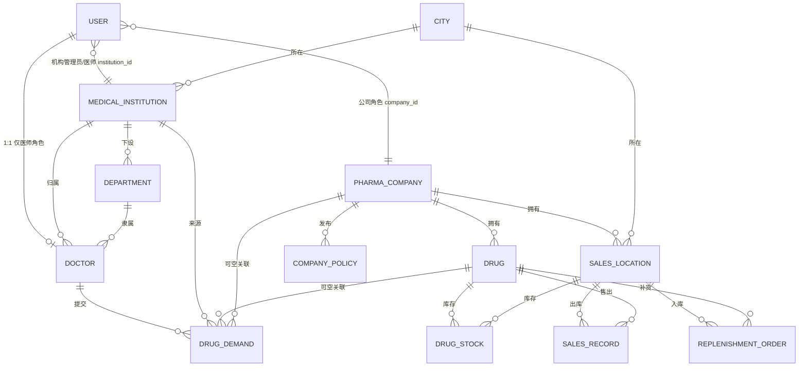
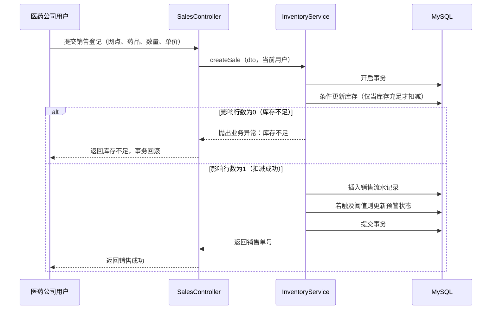
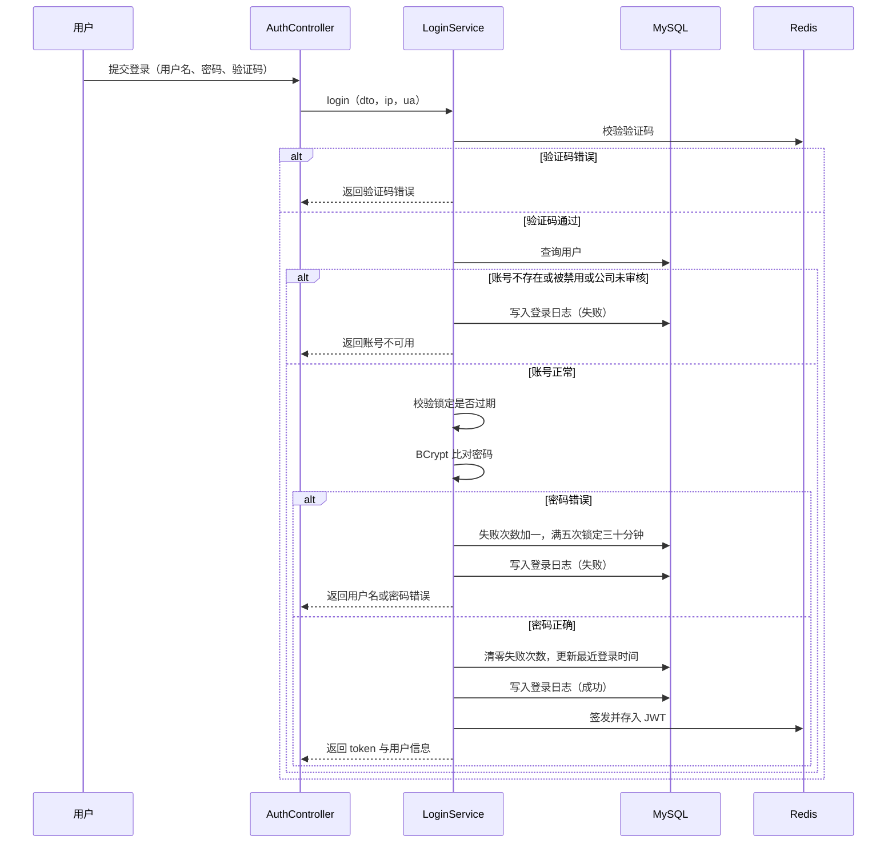
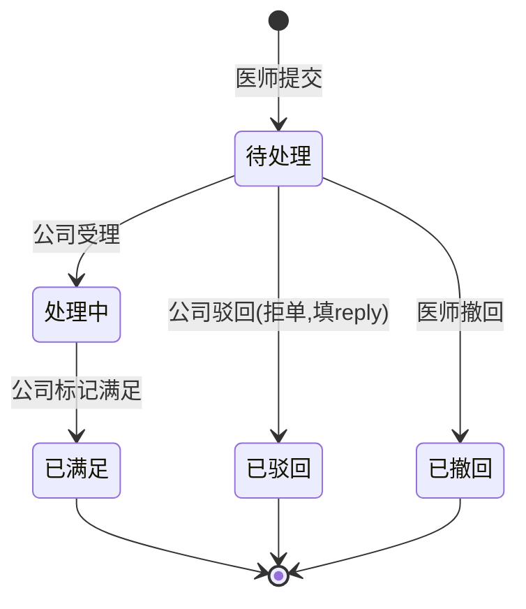
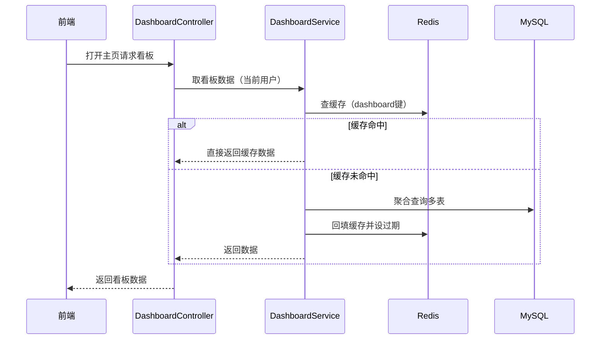
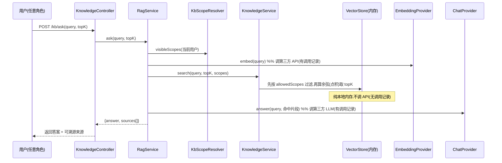
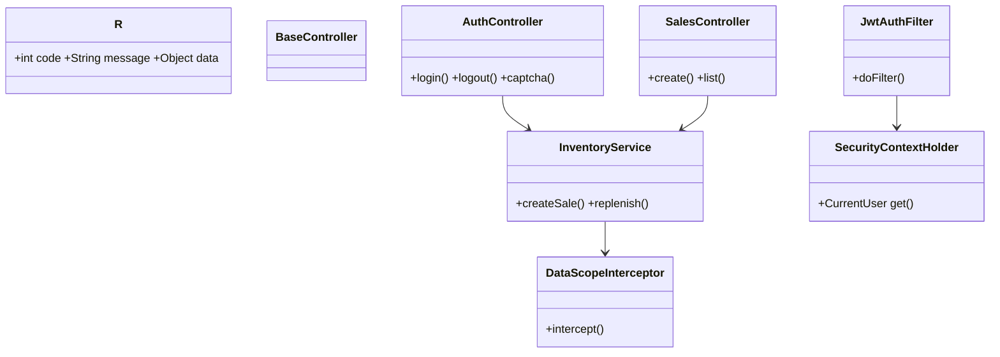

# 慧医数字医疗应用系统 详细设计文档

> 本文档是《慧医数字医疗应用系统 需求分析报告》的实现级设计,继承其角色定义、业务闭环、权限矩阵、字段命名与技术选型,**与需求分析文档保持一致**。需求文档定义"做什么",本文档定义"怎么做"。

---

## 目录

1. [引言](#1-引言)
2. [系统总体设计](#2-系统总体设计)
3. [数据库设计](#3-数据库设计)
4. [模块详细设计](#4-模块详细设计)
5. [接口设计](#5-接口设计)
6. [关键流程设计](#6-关键流程设计)
7. [安全设计](#7-安全设计)
8. [前端设计](#8-前端设计)
9. [非功能实现](#9-非功能实现)
10. [附录](#10-附录)
11. [演进规划](#11-演进规划)

---

## 1. 引言

### 1.1 编写目的

本文档在需求分析报告的基础上,完成系统的**总体架构、数据库、模块、接口、关键流程、安全与前端**的详细设计,作为编码实现、联调测试与课程设计评审的依据。读者为:开发实施人员(后端 / 前端)、评审教师、后续维护者。

### 1.2 适用范围

覆盖需求分析报告中"本期聚焦"的全部功能:药品供应链管理(药品 / 库存 / 销售 / 补货)、医师资源管理、医药公司及政策管理、必备材料管理、城市信息管理、地图化数据概览、临床用药反馈。不含需求文档标注的二期扩展(EMR、处方流转、医保实时结算、患者端、短信/邮件/医保数据源接口)。

### 1.3 依赖文档

| 文档 | 作用 |
|---|---|
| 《慧医数字医疗应用系统 需求分析报告》 | 功能基线、角色、权限矩阵、业务闭环、非功能指标、接口规范 |
| 本《详细设计文档》 | 实现级设计(本文档) |

本文档中涉及的**用例编号**(UC-A04、UC-A07 等)、**字段名**、**角色名**、**闭环步骤编号**(①~⑦)均与需求分析报告保持一致。

### 1.4 术语与缩略语

| 术语 | 含义 |
|---|---|
| 行级隔离 | 通过 `company_id` / `institution_id` / `doctor_id` 限定每条查询/操作可见的数据范围 |
| 软删除 | `deleted=1` 标记而非物理删除,配合 `@TableLogic` |
| append-only | 只增不删,流水/日志表策略 |
| 防超卖 | 并发销售扣减时,库存不被扣成负数 |
| 闭环 | 药品录入→铺货→销售→预警→补货→终端查询→临床用药反馈→供给回流 |
| RBAC | 基于角色的访问控制 |
| GCJ-02 | 高德地图使用的火星坐标系 |

---

## 2. 系统总体设计

### 2.1 总体架构

采用 **B/S 架构、前后端分离**:

```
┌──────────────┐   HTTPS/JSON    ┌──────────────────────────────┐   JDBC    ┌──────────┐
│   浏览器      │ ──────────────▶ │        应用服务层             │ ────────▶ │  MySQL   │
│ Vue3 + Vite  │                 │  Spring Boot 3.2.x (内置Tomcat)│           │ (持久化)  │
│ Element Plus │ ◀────────────── │  Controller→Service→Mapper   │ ◀───────▶ │          │
│ ECharts/高德  │   {code,msg,data}│                              │  Redis协议 │ ┌────────┐|
└──────────────┘                 └──────────────────────────────┘           │ │ Redis  │ |
                                        ▲                                     │ └────────┘ |
                                        │ Nginx 反向代理 + 静态资源              └──────────┘
```

- 前端构建为静态资源,由 **Nginx** 托管并反向代理 `/api/**` 至后端;
- 应用服务**无状态**,会话存于 Redis,支持后续水平扩展;
- **看板/字典等热点数据缓存优先读**(见 6.6):首页查询先命中 Redis,miss 才回库;
- 本期单机部署即可满足(网点百级、库存千级、并发 ≥50)。

### 2.2 技术选型(与需求文档 2.x 一致)

| 层 | 选型 | 说明 |
|---|---|---|
| 运行环境 | **JDK 22 (openjdk-22)** | Lombok 在 25-EA 会让编译挂,故统一用 22(非 17) |
| 后端框架 | **Spring Boot 3.2.x** | 内置 Tomcat |
| 持久层 | **MyBatis-Plus** | `@TableLogic` 软删、条件构造器、分页插件 |
| 数据库 | **MySQL 8.0+** | utf8mb4 / InnoDB |
| 连接池/SQL 监控 | **Druid** | 数据库连接池 + 内置 SQL 监控页(慢查询/EXPLAIN,见 M12) |
| DDL 版本管理 | **Flyway** | `db/migration/V{n}__xxx.sql` 管理建表与变更,启动自动迁移;不手改库结构 |
| 缓存/会话 | **Spring Data Redis + Lettuce** | Token;**全局参照数据读穿/写删**(药企/材料/字典/库存预警)、`system_config` KV 走 Redis、**启动预热** |
| 运行监控 | **Spring Boot Actuator + Micrometer** | HTTP/业务指标埋点,系统监控页 SystemView 消费(见 M12) |
| 认证 | **JWT + Spring Security(或自定义拦截器)** | 无状态令牌 |
| 验证码 | **阿里云滑块验证码** | 前端滑块组件 + 后端二次校验;三态门控(enabled/pass/lock,见 6.3)防费用超限 |
| 知识库第三方 | **SiliconFlow** | 嵌入 bge-m3(1024 维)/ 作答 DeepSeek-V3,按量计费;api-key 配置在 application-local.yml(不入库/gitignore) |
| 前端框架 | **Vue 3 + Vite** | 组合式 API |
| 前端 UI | **Element Plus** | 后台管理组件库,医疗稳重风格 |
| 图表 | **ECharts** | 柱状/饼图/分布 |
| 地图 | **高德地图 JS API** | 销售点/机构标注、选点;GCJ-02 |
| 构建/代理 | Maven / Nginx | Maven `-s settings.xml`(aliyun 镜像) |

### 2.3 逻辑分层

```
Controller (rest)        ← 接收请求、参数校验(@Valid)、统一返回 R<T>
   │
Service (biz)            ← 业务逻辑、事务边界(@Transactional)、行级隔离条件、状态机
   │
Mapper (dao)             ← MyBatis-Plus BaseMapper / XML
   │
Entity / DTO / VO        ← Entity 对应表;DTO 入参;VO 出参(脱敏/聚合)
```

- **统一返回体** `R<T>`:`{code, message, data}`,与需求文档 5.2 一致;
- **全局异常处理** `@RestControllerAdvice`:业务异常 → `BusinessException` → 统一错误码;参数校验失败 → 400;
- **参数校验**:`@Valid` + `jakarta.validation` 注解;
- **审计字段自动填充**:`MetaObjectHandler` 自动写入 `create_time/update_time/create_by/update_by`。

### 2.4 模块划分

按需求文档功能类别 A / B 划分为 **14 个模块**,每个模块对应独立的 Controller / Service / Mapper 包:

| 模块 | 对应需求 | 核心表 |
|---|---|---|
| M1 用户与权限 | 3.5.1 / 3.2.1 | user、login_log |
| M2 医师管理 | 3.4.2 | doctor、department |
| M3 医药公司管理 | 3.4.3 | pharma_company、company_policy |
| M4 药品与库存 | 3.4.4(前半) | drug、drug_stock |
| M5 销售与补货 | 3.4.4(后半,核心) | sales_record、replenishment_order、drug_stock |
| M6 销售地点与地图 | 3.4.5 | sales_location、city |
| M7 医疗机构与地图 | 3.4.6 | medical_institution、city |
| M8 临床用药反馈 | 3.4.7 | drug_demand |
| M9 数据概览看板 | 3.4.1 | 聚合多表 |
| M10 基础支撑 | 3.5.2 / 3.5.3 / 4.5 / 字典 | essential_material、city、sys_dict、*_log |
| M11 通知中心 | 支撑性 | notification |
| M12 系统监控 | 支撑性 | system_config、kb_vector(监控)、`*_log` |
| M13 本地知识库 AI 问答(RAG) | 支撑性 | kb_document、kb_chunk、kb_vector、kb_chat_log |
| M14 缓存 | 支撑性 | Redis(全局参照数据 + system_config 读穿/写删) |

### 2.5 部署架构

| 组件 | 部署 | 说明 |
|---|---|---|
| Nginx | 前置 | 托管前端静态资源;反向代理 `/api/**`;配置 gzip、HTTPS(生产) |
| 应用服务 | 单实例 | Spring Boot jar;预留多实例 + 负载均衡 |
| MySQL | 单实例 | 每日全量备份,保留 30 天 |
| Redis | 单实例 | 会话/缓存 |

> 部署操作遵循"先校验后生效":Nginx 改完先 `nginx -t` 再 `reload`;敏感配置走本地配置文件/环境变量,不入库。

---

## 3. 数据库设计

### 3.1 设计约定

| 约定项 | 规则 |
|---|---|
| 字符集 / 排序 | `utf8mb4` / `utf8mb4_0900_ai_ci`(或 `utf8mb4_unicode_ci`) |
| 存储引擎 | `InnoDB`(事务 + 行锁) |
| 主键 / 外键 | `id BIGINT UNSIGNED AUTO_INCREMENT`;逻辑外键(应用层维护),不建物理 FK 以利分库/软删 |
| 主数据审计字段 | `create_by`、`update_by`(VARCHAR(50),存**用户名快照**)、`create_time`(默认 `CURRENT_TIMESTAMP`)、`update_time`(`ON UPDATE CURRENT_TIMESTAMP`)、`deleted`(TINYINT,0正常/1删除) |
| 金额 | `DECIMAL(10,2)`,禁止 float |
| 经纬度 | `DECIMAL(10,6)`(GCJ-02,约 0.11m) |
| 软删 | 主数据/业务实体表带 `deleted`,MyBatis-Plus `@TableLogic` |
| append-only | 流水/日志表**不带 `deleted`、不带 `update_by`** |
| 软删安全唯一 | 唯一字段一律 `UNIQUE(字段, deleted)`,避免软删后无法重建同名 |
| 建表/变更 | **Flyway** 管理迁移(`V1__init_schema.sql`…),启动自动执行;**禁止手工改库结构**,改动走新版本号脚本 |

> **本次评审新增/修改的字段**(对应需求评审 8 处优化)在表结构中以 `★` 标注:① doctor `unique(user_id, deleted)`;② sys_dict 加唯一;③ pharma_company credit_code 唯一;④ audit_status 改两态(1正常/3停用,#23 删除审核流程与 AuditService,管理员直接 toggleStatus 启停);⑤ medical_institution 加 audit_status;⑥ drug 加 status;⑦ doctor 去掉 account_status;⑧ 新增索引设计章节。

### 3.2 概念模型(ER)



**关系基数说明:**

| 关系 | 基数 | 说明 |
|---|---|---|
| user ↔ doctor | 1 : 0..1 | 仅 role=3(医师)有 doctor 档案,一一对应 |
| user → pharma_company | N : 1 | role=1 绑定 company_id |
| user → medical_institution | N : 1 | role=2/3 绑定 institution_id |
| pharma_company → drug / sales_location / company_policy | 1 : N | |
| drug + sales_location → drug_stock | 1 : 1(每组合) | `unique(drug_id, location_id, deleted)` |
| sales_location → sales_record / replenishment_order | 1 : N | 流水 append-only |
| doctor → drug_demand | 1 : N | 仅本人可见 |
| drug_demand → drug / pharma_company | 0..1 | 手填时为空,进"未关联池" |

### 3.3 表结构(23 张表)

> 编号沿用 `表 N`;字段格式同需求阶段描述表。带 ★ 者为本次评审优化项。

#### 表 1 user(用户)

| 列名 | 描述 | 数据类型 | 空/非空 | 约束 |
|---|---|---|---|---|
| id | 主键 | BIGINT UNSIGNED | 非空 | PK,自增 |
| username | 登录名 | VARCHAR(50) | 非空 | UNIQUE(username, deleted) |
| password | 密码(BCrypt) | VARCHAR(100) | 非空 | |
| real_name | 真实姓名 | VARCHAR(50) | 空 | |
| role | 角色 | TINYINT | 非空 | 0管理员/1公司/2机构管理员/3医师 |
| company_id | 公司绑定 | BIGINT UNSIGNED | 空 | 行级隔离(role=1) |
| institution_id | 机构绑定 | BIGINT UNSIGNED | 空 | 行级隔离(role=2/3) |
| phone | 手机号 | VARCHAR(20) | 空 | |
| email | 邮箱 | VARCHAR(100) | 空 | |
| status | 账号状态 | TINYINT | 非空 | 默认1;0禁用/1正常(**登录唯一依据**) |
| login_fail_count | 连续失败次数 | INT | 非空 | 默认0 |
| locked_until | 锁定截止时间 | DATETIME | 空 | |
| last_login_time | 最近登录 | DATETIME | 空 | |
| create_by / update_by | 创建/更新人 | VARCHAR(50) | 空 | 用户名快照 |
| create_time / update_time | 时间 | DATETIME | 非空 | 默认/自动更新 |
| deleted | 逻辑删除 | TINYINT | 非空 | 默认0 |

#### 表 2 pharma_company(医药公司)

| 列名 | 描述 | 数据类型 | 空/非空 | 约束 |
|---|---|---|---|---|
| id | 主键 | BIGINT UNSIGNED | 非空 | PK,自增 |
| name | 公司名称 | VARCHAR(100) | 非空 | |
| credit_code | 统一社会信用代码 | VARCHAR(50) | 空 | ★ UNIQUE(credit_code, deleted) |
| license_no | 营业执照号 | VARCHAR(50) | 空 | |
| contact_person | 联系人 | VARCHAR(50) | 空 | |
| contact_phone | 联系电话 | VARCHAR(20) | 空 | |
| address | 公司地址 | VARCHAR(200) | 空 | |
| audit_status | 启停状态 | TINYINT | 非空 | ★ 默认1;**1正常/3停用**(#23 删除审核流程与 AuditService,管理员直接 `toggleStatus` 启停;原 0待审/2驳回 已废) |
| audit_remark | 备注(原审核备注) | VARCHAR(500) | 空 | 审核流程已移除,可记停用原因 |
| audit_time | 启停时间(原审核时间) | DATETIME | 空 | |
| create_by / update_by | 创建/更新人 | VARCHAR(50) | 空 | |
| create_time / update_time | 时间 | DATETIME | 非空 | |
| deleted | 逻辑删除 | TINYINT | 非空 | 默认0 |

#### 表 3 medical_institution(医疗机构)

| 列名 | 描述 | 数据类型 | 空/非空 | 约束 |
|---|---|---|---|---|
| id | 主键 | BIGINT UNSIGNED | 非空 | PK,自增 |
| name | 机构名称 | VARCHAR(100) | 非空 | |
| address | 详细地址 | VARCHAR(200) | 非空 | |
| city_id | 所属城市 | BIGINT UNSIGNED | 非空 | → city.id |
| longitude | 经度(GCJ-02) | DECIMAL(10,6) | 非空 | |
| latitude | 纬度(GCJ-02) | DECIMAL(10,6) | 非空 | |
| contact_person | 联系人 | VARCHAR(50) | 空 | |
| contact_phone | 联系电话 | VARCHAR(20) | 空 | |
| audit_status | 启停状态 | TINYINT | 非空 | ★ 新增;默认1(管理员录入默认正常);**1正常/3停用**,管理员直接 `toggleStatus` 启停(同 pharma_company,审核流程未启用) |
| audit_remark | 备注(原审核备注) | VARCHAR(500) | 空 | ★ 新增 |
| audit_time | 启停时间(原审核时间) | DATETIME | 空 | ★ 新增 |
| create_by / update_by | 创建/更新人 | VARCHAR(50) | 空 | |
| create_time / update_time | 时间 | DATETIME | 非空 | |
| deleted | 逻辑删除 | TINYINT | 非空 | 默认0 |

#### 表 4 department(科室)

| 列名 | 描述 | 数据类型 | 空/非空 | 约束 |
|---|---|---|---|---|
| id | 主键 | BIGINT UNSIGNED | 非空 | PK,自增 |
| institution_id | 所属机构 | BIGINT UNSIGNED | 非空 | → medical_institution.id |
| name | 科室名称 | VARCHAR(50) | 非空 | UNIQUE(institution_id, name, deleted) |
| sort | 排序号 | INT | 非空 | 默认0 |
| create_by / update_by | 创建/更新人 | VARCHAR(50) | 空 | |
| create_time / update_time | 时间 | DATETIME | 非空 | |
| deleted | 逻辑删除 | TINYINT | 非空 | 默认0 |

#### 表 5 doctor(医师)

| 列名 | 描述 | 数据类型 | 空/非空 | 约束 |
|---|---|---|---|---|
| id | 主键 | BIGINT UNSIGNED | 非空 | PK,自增 |
| user_id | 关联账号 | BIGINT UNSIGNED | 非空 | → user.id;★ UNIQUE(user_id, deleted) |
| name | 医师姓名 | VARCHAR(50) | 非空 | |
| institution_id | 所属机构 | BIGINT UNSIGNED | 非空 | → medical_institution.id(本院隔离) |
| department_id | 所属科室 | BIGINT UNSIGNED | 空 | → department.id |
| title | 职称 | VARCHAR(50) | 空 | 医师/主治/副主任/主任 |
| phone | 联系电话 | VARCHAR(20) | 空 | |
| email | 邮箱 | VARCHAR(100) | 空 | |
| create_by / update_by | 创建/更新人 | VARCHAR(50) | 空 | |
| create_time / update_time | 时间 | DATETIME | 非空 | |
| deleted | 逻辑删除 | TINYINT | 非空 | 默认0 |

> ★ 已移除原 `account_status`:登录态统一由 `user.status` 控制,避免双状态字段语义冲突(评审项 ⑦)。

#### 表 6 city(城市)

| 列名 | 描述 | 数据类型 | 空/非空 | 约束 |
|---|---|---|---|---|
| id | 主键 | BIGINT UNSIGNED | 非空 | PK,自增 |
| name | 城市名称 | VARCHAR(50) | 非空 | |
| province | 所属省份 | VARCHAR(50) | 非空 | |
| region_code | 行政区划编码 | VARCHAR(20) | 空 | |
| create_by / update_by | 创建/更新人 | VARCHAR(50) | 空 | |
| create_time / update_time | 时间 | DATETIME | 非空 | |
| deleted | 逻辑删除 | TINYINT | 非空 | 默认0 |

#### 表 7 drug(药品)

| 列名 | 描述 | 数据类型 | 空/非空 | 约束 |
|---|---|---|---|---|
| id | 主键 | BIGINT UNSIGNED | 非空 | PK,自增 |
| name | 药品名称 | VARCHAR(100) | 非空 | |
| specification | 规格 | VARCHAR(100) | 空 | |
| dosage_form | 剂型 | VARCHAR(50) | 空 | |
| company_id | 所属公司 | BIGINT UNSIGNED | 非空 | → pharma_company.id |
| approval_no | 批准文号 | VARCHAR(50) | 空 | UNIQUE(approval_no, deleted) |
| unit | 计量单位 | VARCHAR(20) | 空 | 盒/瓶/支 |
| producer | 生产厂家 | VARCHAR(100) | 空 | |
| status | 上下架状态 | TINYINT | 非空 | ★ 新增;默认1;0下架/1上架;下架后不可被销售登记选中 |
| create_by / update_by | 创建/更新人 | VARCHAR(50) | 空 | |
| create_time / update_time | 时间 | DATETIME | 非空 | |
| deleted | 逻辑删除 | TINYINT | 非空 | 默认0 |

#### 表 8 sales_location(销售地点)

| 列名 | 描述 | 数据类型 | 空/非空 | 约束 |
|---|---|---|---|---|
| id | 主键 | BIGINT UNSIGNED | 非空 | PK,自增 |
| name | 网点名称 | VARCHAR(100) | 非空 | |
| address | 详细地址 | VARCHAR(200) | 非空 | |
| city_id | 所属城市 | BIGINT UNSIGNED | 非空 | → city.id |
| company_id | 所属公司 | BIGINT UNSIGNED | 非空 | → pharma_company.id |
| longitude | 经度(GCJ-02) | DECIMAL(10,6) | 非空 | |
| latitude | 纬度(GCJ-02) | DECIMAL(10,6) | 非空 | |
| contact_person | 联系人 | VARCHAR(50) | 空 | |
| contact_phone | 联系电话 | VARCHAR(20) | 空 | |
| create_by / update_by | 创建/更新人 | VARCHAR(50) | 空 | |
| create_time / update_time | 时间 | DATETIME | 非空 | |
| deleted | 逻辑删除 | TINYINT | 非空 | 默认0 |

#### 表 9 drug_stock(库存)— 核心表

| 列名 | 描述 | 数据类型 | 空/非空 | 约束 |
|---|---|---|---|---|
| id | 主键 | BIGINT UNSIGNED | 非空 | PK,自增 |
| drug_id | 药品 | BIGINT UNSIGNED | 非空 | → drug.id |
| location_id | 销售地点 | BIGINT UNSIGNED | 非空 | → sales_location.id |
| company_id | 所属公司(冗余) | BIGINT UNSIGNED | 非空 | 便于行级隔离 |
| stock_qty | 当前库存 | INT | 非空 | 默认0 |
| price | 销售单价 | DECIMAL(10,2) | 非空 | |
| threshold | 预警阈值 | INT | 非空 | 默认0;stock_qty≤threshold 触发预警 |
| version | 乐观锁版本 | INT | 非空 | 默认0;@Version 兜底编辑冲突 |
| create_by / update_by | 创建/更新人 | VARCHAR(50) | 空 | |
| create_time / update_time | 时间 | DATETIME | 非空 | |
| deleted | 逻辑删除 | TINYINT | 非空 | UNIQUE(drug_id, location_id, deleted) |

> `version` 与条件更新分工:**销售扣减**用 `WHERE stock_qty>=?` 条件更新(天然防超卖,见 6.1);**编辑售价/阈值**用 `@Version` 乐观锁防并发覆盖。

#### 表 10 sales_record(销售流水)— append-only

| 列名 | 描述 | 数据类型 | 空/非空 | 约束 |
|---|---|---|---|---|
| id | 主键 | BIGINT UNSIGNED | 非空 | PK,自增 |
| record_no | 销售单号 | VARCHAR(32) | 非空 | UNIQUE;如 SAL20260729001 |
| location_id | 销售地点 | BIGINT UNSIGNED | 非空 | → sales_location.id |
| drug_id | 药品 | BIGINT UNSIGNED | 非空 | → drug.id |
| company_id | 所属公司(冗余) | BIGINT UNSIGNED | 非空 | 隔离/统计 |
| qty | 销售数量 | INT | 非空 | |
| price | 销售单价(快照) | DECIMAL(10,2) | 非空 | 售价变更不影响历史 |
| amount | 总金额=qty×price | DECIMAL(12,2) | 非空 | |
| sale_time | 销售时间 | DATETIME | 非空 | |
| remark | 备注 | VARCHAR(200) | 空 | |
| create_by | 操作人 | VARCHAR(50) | 空 | |
| create_time | 创建时间 | DATETIME | 非空 | 默认 CURRENT_TIMESTAMP |

#### 表 11 replenishment_order(补货流水)— append-only

| 列名 | 描述 | 数据类型 | 空/非空 | 约束 |
|---|---|---|---|---|
| id | 主键 | BIGINT UNSIGNED | 非空 | PK,自增 |
| order_no | 补货单号 | VARCHAR(32) | 非空 | UNIQUE;如 REP20260729001 |
| location_id | 销售地点 | BIGINT UNSIGNED | 非空 | → sales_location.id |
| drug_id | 药品 | BIGINT UNSIGNED | 非空 | → drug.id |
| company_id | 所属公司(冗余) | BIGINT UNSIGNED | 非空 | |
| qty | 入库数量 | INT | 非空 | |
| in_time | 入库时间 | DATETIME | 非空 | |
| remark | 备注 | VARCHAR(200) | 空 | |
| create_by | 操作人 | VARCHAR(50) | 空 | |
| create_time | 创建时间 | DATETIME | 非空 | 默认 CURRENT_TIMESTAMP |

#### 表 12 company_policy(公司政策)

| 列名 | 描述 | 数据类型 | 空/非空 | 约束 |
|---|---|---|---|---|
| id | 主键 | BIGINT UNSIGNED | 非空 | PK,自增 |
| company_id | 所属公司 | BIGINT UNSIGNED | 非空 | → pharma_company.id |
| title | 政策标题 | VARCHAR(200) | 非空 | |
| content | 政策正文 | TEXT | 非空 | |
| policy_type | 政策类型 | TINYINT | 非空 | 默认1;1医保/2药企/3价格 |
| effective_date | 生效日期 | DATE | 非空 | |
| expire_date | 失效日期 | DATE | 空 | |
| create_by / update_by | 创建/更新人 | VARCHAR(50) | 空 | |
| create_time / update_time | 时间 | DATETIME | 非空 | |
| deleted | 逻辑删除 | TINYINT | 非空 | 默认0 |

#### 表 13 drug_demand(临床用药反馈)

| 列名 | 描述 | 数据类型 | 空/非空 | 约束 |
|---|---|---|---|---|
| id | 主键 | BIGINT UNSIGNED | 非空 | PK,自增 |
| doctor_id | 提交医师 | BIGINT UNSIGNED | 非空 | → doctor.id(仅本人可见) |
| institution_id | 医师机构 | BIGINT UNSIGNED | 非空 | → medical_institution.id |
| drug_name | 药品名称 | VARCHAR(100) | 非空 | 必填,可手填 |
| drug_id | 关联药品 | BIGINT UNSIGNED | 空 | → drug.id;可空 |
| company_id | 关联公司 | BIGINT UNSIGNED | 空 | 空→"未关联临床反馈池"由管理员指派 |
| demand_type | 反馈类型 | TINYINT | 非空 | 1临床用药需求/2临床用量反馈 |
| qty | 需求数量 | INT | 非空 | |
| urgency | 紧急度 | TINYINT | 非空 | 1一般/2紧急 |
| status | 状态 | TINYINT | 非空 | 默认0;0待处理/1处理中/2已满足/3已驳回/4已撤回 |
| remark | 需求说明 | VARCHAR(500) | 空 | |
| reply | 公司回复 | VARCHAR(500) | 空 | |
| handler_id | 处理人 | BIGINT UNSIGNED | 空 | → user.id |
| handle_time | 处理时间 | DATETIME | 空 | |
| create_by / update_by | 创建/更新人 | VARCHAR(50) | 空 | |
| create_time / update_time | 时间 | DATETIME | 非空 | |
| deleted | 逻辑删除 | TINYINT | 非空 | 默认0 |

> 状态机要点(详见 6.5):**驳回(reject)只从「待处理(0)」转「已驳回(3)」**(与受理并列,即"拒单",#72),**不从「处理中」驳回**;reply 必填。另:机构管理员角色对本表为**只读视图**——仅可查看本机构医师提交的反馈(`institution_id` 隔离,无受理/回复/驳回等流转操作,#167)。

#### 表 14 essential_material(必备材料)

| 列名 | 描述 | 数据类型 | 空/非空 | 约束 |
|---|---|---|---|---|
| id | 主键 | BIGINT UNSIGNED | 非空 | PK,自增 |
| name | 材料名称 | VARCHAR(100) | 非空 | |
| category | 类别 | VARCHAR(50) | 非空 | 器械/耗材/许可证/检验报告 |
| specification | 规格 | VARCHAR(100) | 空 | |
| unit | 单位 | VARCHAR(20) | 空 | |
| content | 内容说明 | TEXT | 空 | |
| create_by / update_by | 创建/更新人 | VARCHAR(50) | 空 | |
| create_time / update_time | 时间 | DATETIME | 非空 | |
| deleted | 逻辑删除 | TINYINT | 非空 | 默认0 |

#### 表 15 login_log(登录日志)— append-only,保留 180 天

| 列名 | 描述 | 数据类型 | 空/非空 | 约束 |
|---|---|---|---|---|
| id | 主键 | BIGINT UNSIGNED | 非空 | PK,自增 |
| user_id | 用户ID | BIGINT UNSIGNED | 空 | |
| username | 登录名 | VARCHAR(50) | 非空 | |
| login_time | 登录时间 | DATETIME | 非空 | |
| ip | IP 地址 | VARCHAR(50) | 空 | |
| user_agent | 浏览器标识 | VARCHAR(255) | 空 | |
| login_result | 登录结果 | TINYINT | 非空 | 0失败/1成功 |
| fail_reason | 失败原因 | VARCHAR(100) | 空 | |
| anomaly | 异常标记 ★ | TINYINT | 非空 | 默认0;V5 加列;0正常/1异常IP(老用户首次从该 IP 登录,疑似异地/盗号) |
| anomaly_reason | 异常原因 ★ | VARCHAR(100) | 空 | V5 加列;异地/高频等 |

#### 表 16 error_log(错误日志)— append-only,保留 30 天

| 列名 | 描述 | 数据类型 | 空/非空 | 约束 |
|---|---|---|---|---|
| id | 主键 | BIGINT UNSIGNED | 非空 | PK,自增 |
| error_time | 错误时间 | DATETIME | 非空 | |
| user_id | 用户ID | BIGINT UNSIGNED | 空 | |
| request_url | 请求地址 | VARCHAR(500) | 空 | |
| request_param | 请求参数 | TEXT | 空 | |
| error_type | 异常类名 | VARCHAR(100) | 空 | |
| error_message | 错误消息 | VARCHAR(2000) | 空 | |
| stack_trace | 完整堆栈 | TEXT | 空 | |
| ip | IP 地址 | VARCHAR(50) | 空 | |

#### 表 17 operation_log(操作日志)— append-only,保留 180 天

| 列名 | 描述 | 数据类型 | 空/非空 | 约束 |
|---|---|---|---|---|
| id | 主键 | BIGINT UNSIGNED | 非空 | PK,自增 |
| user_id | 操作人ID | BIGINT UNSIGNED | 空 | |
| username | 操作人名 | VARCHAR(50) | 空 | |
| module | 操作模块 | VARCHAR(50) | 非空 | |
| operation | 操作类型 | VARCHAR(50) | 非空 | 增/删/改/销售扣减等 |
| target_type | 对象类型 | VARCHAR(50) | 空 | |
| target_id | 对象ID | VARCHAR(50) | 空 | |
| method | HTTP 方法 | VARCHAR(10) | 空 | |
| request_url | 请求地址 | VARCHAR(500) | 空 | |
| request_param | 请求参数 | TEXT | 空 | |
| before_data | 变更前数据 | TEXT | 空 | JSON 快照 |
| after_data | 变更后数据 | TEXT | 空 | JSON 快照 |
| cost_time | 耗时(ms) | BIGINT | 空 | |
| operation_time | 操作时间 | DATETIME | 非空 | |
| ip | IP 地址 | VARCHAR(50) | 空 | |
| sensitive | 敏感操作标记 ★ | TINYINT | 非空 | 默认0;V4 加列、V6 回填历史、V7 把登录/登出等**认证类操作移出敏感**(敏感只留写操作);由 OperationLogAspect 切面按"敏感表(用户)+关键词(删除/停用/重置/密码/权限/角色/解锁/锁定/驳回/审核)"自动判定 |

#### 表 18 sys_dict(数据字典)

| 列名 | 描述 | 数据类型 | 空/非空 | 约束 |
|---|---|---|---|---|
| id | 主键 | BIGINT UNSIGNED | 非空 | PK,自增 |
| dict_type | 字典类型 | VARCHAR(50) | 非空 | 如 drug_demand_status |
| dict_key | 键值 | VARCHAR(50) | 非空 | 如 0/1/2 |
| dict_value | 显示文本 | VARCHAR(100) | 非空 | 如 待处理 |
| sort | 排序 | INT | 非空 | 默认0 |
| deleted | 逻辑删除 | TINYINT | 非空 | 默认0 |

> ★ UNIQUE(dict_type, dict_key, deleted)(评审项 ②),防止重复字典项。字典类型清单:`user_role`、`audit_status`、`drug_status`、`demand_type`、`demand_urgency`、`demand_status`、`policy_type` 等,前端下拉与状态标签统一取此表。

#### 表 19 notification(站内通知)— V2 新增

> 支撑 M11 通知中心。站内通知:库存预警 / 反馈流转 / 药企启停 / 系统;`ref_type + ref_id` 指向相关业务对象,关联靠应用层 + 索引(无物理外键,对齐 V1 约定)。

| 列名 | 描述 | 数据类型 | 空/非空 | 约束 |
|---|---|---|---|---|
| id | 主键 | BIGINT UNSIGNED | 非空 | PK,自增 |
| user_id | 接收者 | BIGINT UNSIGNED | 非空 | → user.id |
| category | 类目 | TINYINT | 非空 | 0库存预警/1反馈流转/2药企审核/3系统 |
| title | 标题 | VARCHAR(120) | 非空 | |
| body | 正文 | VARCHAR(500) | 空 | |
| ref_type | 关联对象类型 | VARCHAR(30) | 空 | DEMAND/COMPANY/STOCK |
| ref_id | 关联对象ID | BIGINT UNSIGNED | 空 | |
| is_read | 已读标记 | TINYINT | 非空 | 默认0;0未读/1已读 |
| create_by / update_by | 创建/更新人 | VARCHAR(50) | 空 | |
| create_time / update_time | 时间 | DATETIME | 非空 | 默认/自动更新 |
| deleted | 逻辑删除 | TINYINT | 非空 | 默认0 |

> 索引:`idx_user_read(user_id, is_read)`(未读数/铃铛)、`idx_user_time(user_id, create_time)`(列表倒序)。

#### 表 20 system_config(系统配置 KV)— V8 新增

> 支撑 M12 系统监控 / M14 缓存。通用 KV 配置:`config_key` 作主键,单行按 key 取值,适合"管理员可改的少量全局开关"。当前承载 `captcha.mode`(enabled/pass/lock)与 `kb.enabled`(true/false)。属**无租户隔离的全局参照数据**,接 Redis 读穿/写删。

| 列名 | 描述 | 数据类型 | 空/非空 | 约束 |
|---|---|---|---|---|
| config_key | 配置键 | VARCHAR(64) | 非空 | PK |
| config_value | 配置值 | VARCHAR(255) | 空 | |
| description | 说明 | VARCHAR(255) | 空 | |
| update_time | 更新时间 | DATETIME | 非空 | 默认/自动更新 |
| updated_by | 操作人 | BIGINT | 空 | → user.id |

#### 表 21 kb_document(知识库文档)— V9 新增,V11 加 scope

> 支撑 M13 本地知识库 RAG。文档元信息(向量本身存 kb_vector / 外部 VectorStore,此处只存文本+元信息,可回显、可重建索引)。

| 列名 | 描述 | 数据类型 | 空/非空 | 约束 |
|---|---|---|---|---|
| id | 主键 | BIGINT | 非空 | PK,自增 |
| title | 标题 | VARCHAR(255) | 非空 | |
| source_type | 来源类型 | VARCHAR(32) | 非空 | 默认 manual;manual/file/url(自动建库用业务表名:drug/essential_material/...) |
| source_ref | 来源引用 | VARCHAR(255) | 空 | 业务主键,便于溯源 |
| content_hash | 内容哈希 | CHAR(64) | 空 | SHA-256,去重用 |
| chunk_count | 切块数 | INT | 非空 | 默认0 |
| status | 状态 | VARCHAR(16) | 非空 | 默认 ACTIVE |
| scope | 可见范围 ★ | VARCHAR(48) | 非空 | V11 加列,默认 GLOBAL;GLOBAL / COMPANY:{id} / INSTITUTION:{id} |
| created_by | 创建人 | BIGINT | 空 | → user.id |
| created_at | 创建时间 | DATETIME | 非空 | 默认 CURRENT_TIMESTAMP |

#### 表 22 kb_chunk(知识库切块)— V9 新增

> 支撑 M13。文档切块的文本与元数据;`(doc_id, ordinal)` 与向量库 id(`{doc_id}:{ordinal}`)对齐。

| 列名 | 描述 | 数据类型 | 空/非空 | 约束 |
|---|---|---|---|---|
| id | 主键 | BIGINT | 非空 | PK,自增 |
| doc_id | 所属文档 | BIGINT | 非空 | → kb_document.id |
| ordinal | 块序号 | INT | 非空 | 从 0;(doc_id, ordinal) 与向量库 id 对齐 |
| text | 块文本 | MEDIUMTEXT | 非空 | |
| token_count | 近似长度 | INT | 空 | 字符数 |
| metadata | 回显元数据 | TEXT | 空 | JSON 文本:{title, sourceType, ...} |
| created_at | 创建时间 | DATETIME | 非空 | 默认 CURRENT_TIMESTAMP |

#### 表 23 kb_vector(知识库向量存档)— V10 新增,V11 加 scope

> 支撑 M13。**B 方案:向量以 JSON 存 MySQL 做存档,应用 `ApplicationReadyEvent` 时 warmUp 全量加载进内存 `ConcurrentHashMap` 做余弦检索**(重启不丢、省嵌入 API 额度,几 MB 内存适配 2核2G)。切纯内存设 `huiyi.kb.vectorstore.impl=memory`,本表闲置。

| 列名 | 描述 | 数据类型 | 空/非空 | 约束 |
|---|---|---|---|---|
| id | 向量ID | VARCHAR(128) | 非空 | PK;`{doc_id}:{ordinal}`,与 kb_chunk 对齐 |
| vector | 向量 | LONGTEXT | 非空 | JSON 数组 [f0,f1,...](bge-m3 1024 维,已 L2 归一化) |
| scope | 可见范围 ★ | VARCHAR(48) | 非空 | V11 加列,默认 GLOBAL;检索过滤用 |
| created_at | 创建时间 | DATETIME | 非空 | 默认 CURRENT_TIMESTAMP |

> 索引:`idx_kb_vector_scope(scope)`(V11,按 scope 预过滤)。

#### 表 24 kb_chat_log(知识库对话日志)— V12 新增

> 支撑 M13。记录每次 `/ask` 的提问/作答/命中数,供管理员审计 + 异常提问检测。异常标记规则:**0 来源命中**(知识库答不上)或同一用户 10 分钟内提问 > 10 次(高频);命中任一即 flagged=1。双能力下 0 命中=回退通用知识,该标记即「知识库盲区」信号(用户问了什么而库没有)。

| 列名 | 描述 | 数据类型 | 空/非空 | 约束 |
|---|---|---|---|---|
| id | 日志ID | BIGINT | 非空 | PK,AUTO |
| user_id | 提问用户 id | BIGINT | 空 | |
| username | 提问用户登录名 | VARCHAR(64) | 空 | |
| role | 提问用户角色 | TINYINT | 空 | 0管理员/1药企/2机构/3医师 |
| query_text | 用户提问 | VARCHAR(500) | 非空 | 超长截断 |
| answer_text | 知识库作答 | TEXT | 空 | 超长截断(已剔除动作标记) |
| hit_count | 命中来源片段数 | INT | 非空 | 默认 0;0=知识库答不上(触发通用知识回退) |
| flagged | 异常标记 | TINYINT(1) | 非空 | 默认 0;0命中/高频 |
| flag_reason | 异常原因 | VARCHAR(64) | 空 | 0命中 / 高频 / 0命中+高频 |
| created_at | 提问时间 | DATETIME | 非空 | 默认 CURRENT_TIMESTAMP |

> 索引:`idx_kb_chat_log_user_time(user_id, created_at)`(高频窗口计数)、`idx_kb_chat_log_flagged(flagged)`(筛异常)、`idx_kb_chat_log_created(created_at)`(时间倒序分页)。

### 3.4 索引设计 ★

> 评审项 ⑧:除主键与唯一索引外,补充以下**业务查询热路径**二级索引。

| 表 | 索引 | 用途 |
|---|---|---|
| user | `idx_role_status (role, status)` | 按角色 + 状态筛选账号 |
| user | `idx_company (company_id)` | 公司行级隔离查询 |
| user | `idx_institution (institution_id)` | 机构行级隔离查询 |
| doctor | `idx_institution_dept (institution_id, department_id)` | 本院医师/科室分布 |
| drug | `idx_company (company_id)` | 本公司药品列表 |
| drug_stock | `idx_company_drug (company_id, drug_id)` | 公司库存统计/隔离 |
| drug_stock | `idx_location (location_id)` | 网点库存查询 |
| sales_record | `idx_loc_time (location_id, sale_time)` | 网点销售趋势 |
| sales_record | `idx_drug_time (drug_id, sale_time)` | 药品销售趋势 |
| sales_record | `idx_company_time (company_id, sale_time)` | 公司发展查询 |
| replenishment_order | `idx_loc_time (location_id, in_time)` | 网点入库趋势 |
| drug_demand | `idx_status_company (status, company_id)` | 公司待处理临床反馈列表 |
| drug_demand | `idx_doctor (doctor_id)` | 医师"我的反馈" |
| login_log | `idx_user_time (user_id, login_time)` | 登录审计 |
| operation_log | `idx_module_time (module, operation_time)` | 操作审计 |
| error_log | `idx_time (error_time)` | 错误清理与排查 |

### 3.5 约束与软删/引用规则

继承需求文档 3.5.4,补充实现级说明:

| 规则 | 实现 |
|---|---|
| 软删过滤 | `@TableLogic` 全局生效,业务代码不写 `deleted=0` |
| 软删引用校验 | 删城市/药品/网点前,Service 先 `count` 引用表(网点/机构/库存),有则抛 `BusinessException` 中止 |
| append-only | sales_record / replenishment_order / 三日志表 Mapper **不提供 update/delete 方法**(接口层裁剪) |
| 冗余字段一致性 | drug_stock/sales_record/replenishment_order 的 `company_id` 在创建时从 drug/location 取值并固化,后续不随 drug.company_id 变更 |
| 日志清理 | 定时任务按 `*_time < now()-保留期` 物理删除(见 9.2) |
| 业务单据(drug_demand) | 归属"主数据"范畴——带 `deleted` 软删;**撤回/驳回仅改 `status`,不删记录**,随状态流转全程保留以备审计与用药趋势汇总(区别于 append-only 流水) |

---

## 4. 模块详细设计

> 每个模块给出:功能要点、核心类、关键流程、对外接口(接口清单见第 5 章)。用例编号、字段与需求文档一致。

### 4.1 用户与权限模块(M1)

**功能**(需求 3.5.1 / 3.2.1):账号管理、权限认证(RBAC + 行级隔离)、重置密码、登录(图形验证码)、账号锁定、登出。

**核心类**:
- `AuthController`(登录/登出/刷新)、`UserController`(账号 CRUD)、`LoginService`、`JwtUtil`、`SecurityContextHolder`(线程内当前用户)。
- 拦截器:`JwtAuthFilter` 解析 Token → 写入 `ThreadLocal` 当前用户(role/company_id/institution_id/doctor_id)。
- 行级隔离:`DataScopeInterceptor`(MyBatis-Plus 内部插件或自定义 SQL 解析),按当前用户自动追加 `company_id`/`institution_id` 条件(见 6.2)。

**关键流程**:登录与账号锁定见 6.3。

**业务规则**:
- 初始账号:`admin` / `admin123`(BCrypt),SQL 预置;
- 连续 5 次失败 → `locked_until = now()+30min`,`login_fail_count` 清零于成功时;
- 医药公司账号仅当 `pharma_company.audit_status=1(正常)` 且 `user.status=1` 方可登录(对应需求 3.2.1 备选 4c)。

### 4.2 医师管理模块(M2)

**功能**(需求 3.4.2):新增/改/删(软删)医师、分配科室、重置密码(仅本院)。

**核心类**:`DoctorController`、`DoctorService`、`DepartmentService`、`DoctorMapper`。

**关键设计**:
- 新增医师 = 同时建 `user`(role=3, status=1)+ `doctor`(user_id 回填),**同事务**;`username` 唯一性受 `UNIQUE(username, deleted)` 保护;
- 分配科室:校验目标科室 `institution_id` 必须与医师 `institution_id` 一致(防越院调配),写 `operation_log(before/after)`;
- 行级隔离:机构管理员仅见 `institution_id = 当前机构` 的医师。

### 4.3 医药公司管理模块(M3)

**功能**(需求 3.4.3):公司信息维护、公司启停、政策维护、发展查询。

**核心类**:`PharmaCompanyController`、`PharmaCompanyService`、`CompanyPolicyController`。

**关键设计**:
- **启停两态**:`audit_status` 取 **1 正常 / 3 停用**(#23 已删除审核流程与 `AuditService`,改为管理员直接 `PUT /companies/{id}/status` 启停 `toggleStatus`;`status` 为空则在正常/停用间翻转)。原"待审核/驳回"流程已废弃,医药公司账号仅当 `audit_status=1(正常)` 且 `user.status=1` 方可登录;
- 政策发布:校验 `effective_date`;发布后在看板"最新政策"展示(取 `effective_date <= 当前 <= expire_date or expire_date is null`);
- 发展查询:聚合本公司 `drug` 数、`sales_location` 数、按月 `sales_record` 汇总、`company_policy` 数。

### 4.4 药品与库存模块(M4)

**功能**(需求 3.4.4 前半):药品 CRUD、库存初始化(铺货 UC-A04-1)、库存与售价维护、库存查询、库存预警列表。

**核心类**:`DrugController`、`DrugStockController`、`StockAlertService`。

**关键设计**:
- 药品 `status`:上架药品方可被铺货/销售选中;下架不删历史;
- 铺货:`unique(drug_id, location_id, deleted)` 防重复;校验"药品×地点"不存在才插入;
- 库存预警:`stock_qty <= threshold` 的记录,结果可缓存 Redis(见 9.1),看板红色展示。

### 4.5 销售与补货模块(M5,核心)

**功能**(需求 3.4.4 后半):销售登记(UC-A04,扣减)、补货入库(UC-A04-2)、销售/补货记录查询、进销存台账汇总。

**核心类**:`SalesController`、`ReplenishmentController`、`InventoryService`(事务核心)。

**关键流程:销售扣减防超卖事务**(详见 6.1)——`@Transactional` 内:插 `sales_record` + 条件更新扣 `drug_stock.stock_qty` + 判阈值更新预警。

**关键流程:补货入库**(UC-A04-2)——事务内:插 `replenishment_order` + `drug_stock.stock_qty += qty`(无超卖风险,但需判库存记录存在)。

**进销存台账**:`累计入库 = SUM(replenishment.qty)`、`累计销售 = SUM(sales.qty)`、`当前库存 = drug_stock.stock_qty`,三值可对账校验。

### 4.6 销售地点与地图模块(M6)

**功能**(需求 3.4.5):网点 CRUD(含地图选点)、地图标注。

**关键设计**:
- 选点:前端嵌入高德地图组件,搜索/拖拽 → 回填 GCJ-02 经纬度;
- 地图标注:后端返回本公司(或全局)`sales_location` 的 `{name, lng, lat, drugCount/salesQty}`,前端高德 JS API 渲染点位,点击弹详情;
- 删除:校验是否存在有效库存(需求 3.5.4 引用约束)。

### 4.7 医疗机构与地图模块(M7)

**功能**(需求 3.4.6):机构 CRUD(含选点)、机构地图展示、聚合该院医师数。

**关键设计**:`medical_institution` 带 `audit_status`(★ 新增,与 pharma_company 同为**两态 1 正常 / 3 停用**),管理员录入默认 `正常(1)`,经 `PUT /institutions/{id}/status` 直接启停;机构是"本院"隔离与医师地理分布地图的坐标来源。

### 4.8 临床用药反馈模块(M8)

**功能**(需求 3.4.7):医师提交/查看/撤回;医药公司列表/受理/回复/标记;管理员指派未关联反馈。

**状态机**(详见 6.5):`待处理(0) → 处理中(1) → 已满足(2)`;公司亦可 **`待处理(0) → 已驳回(3)`**(与受理并列,即"拒单",#72);医师可 `待处理(0) → 已撤回(4)`。公司操作各自对应独立端点:

| 公司操作 | 端点 | 触发的状态转移 | 前置状态 | 备注 |
|---|---|---|---|---|
| 受理 | `PUT /demands/{id}/accept` | 待处理(0) → 处理中(1) | 待处理 | 进入处理态,锁定由本公司跟进 |
| 标记已满足 | `PUT /demands/{id}/satisfy` | 处理中(1) → 已满足(2) | 处理中 | `reply` 选填,可附补货/铺货说明 |
| 驳回(拒单) | `PUT /demands/{id}/reject` | **待处理(0) → 已驳回(3)** | **待处理** | **必填 `reply`** 说明原因 |

> 每次转移回填 `handler_id`/`handle_time`/`reply` 并写 `operation_log`;该映射与 6.5 状态机图完全一致,避免"受理/回复/标记"措辞与状态值脱节。**驳回只从待处理(0),不从处理中(1)**。

**关键设计**:
- 提交:`drug_name` 必填;选已有药品则带出 `drug_id`/`company_id`,手填则二者空 → 进"未关联临床反馈池"(管理员可见,指派 `company_id`);
- 隔离:医师见 `doctor_id=本人`;公司见 `company_id=本公司`;**机构管理员见 `institution_id=本院` 且为只读视图(无受理/回复/驳回等流转操作,#167)**;管理员见全部并可指派未关联反馈;
- 处理时一键跳转"补货/铺货",形成到 ②④ 的回流(需求 3.4.7 业务规则 3)。

### 4.9 数据概览看板模块(M9)

**功能**(需求 3.4.1):四角色角色化看板;ECharts 图表 + 高德地图。

**关键设计**:
- 管理员:全国总数、医师地理分布地图(按机构聚合医师数)、职称/科室分布、公司总数(按启停态);
- 公司:本公司药品数、覆盖网点数、销售点地图标注、库存预警列表、待处理临床反馈数、销售统计;
- 机构管理员:本院医师数、科室人员分布、可售药品查询;
- 医师:个人信息(可自助改联系方式)、药品/政策/材料公告、我的反馈及状态;
- **缓存优先读**(见 6.6):看板请求先查 Redis(`dashboard:{role}:{userId}`),命中直接返回;未命中才走聚合 SQL 并回填缓存,首页响应以缓存为主;
- 统计 SQL 走索引(3.4),热点结果 Redis 缓存(见 9.1)。

### 4.10 基础支撑模块(M10)

**功能**(需求 3.5.2 / 3.5.3 / 4.5 / 字典):必备材料 CRUD、城市 CRUD(删前校验引用)、数据字典、日志(登录/操作/错误)。

**关键设计**:
- 城市删除:校验 `sales_location`/`medical_institution` 引用,有则禁止;
- 操作日志:`@OperationLog` 注解 + AOP,自动记录 module/operation/before/after/cost_time;
- 字典:前端下拉/状态标签统一取 `sys_dict`,避免枚举散落。

### 4.11 通知中心模块(M11)

**职责**:站内通知的产出与消费。库存预警 / 反馈流转(受理·满足·驳回·指派)/ 药企启停 / 系统公告四类,统一进 `notification` 表,各业务 Service 在状态流转时调 `NotificationService.notifyXxx(...)` 落库。

**核心类/表**:`NotificationController`、`NotificationService`、`notification`(表 19)。

**消费侧**:顶栏铃铛——页面**可见时每 60s 轮询**未读数(`GET /notifications/unread`),切到后台/隐藏时**停止轮询**;右侧抽屉按类目/关键词/已读筛选、支持"单条已读 / 全部已读"。每次状态流转同步产通知,形成业务闭环的可感知触达。

### 4.12 系统监控模块(M12)

**职责**:把 Actuator/Micrometer/Druid/Redis/KB 的运行时指标聚合到管理员监控页 `SystemView`,并把管理员可改的全局开关托管在 `system_config`。

**核心类/表**:`SystemController`、`SystemService`、`SystemConfigService`、`CaptchaMode`、`system_config`(表 20)。`SystemMetricsVO` 聚合 JVM / DB 连接池 / Redis / HTTP(`http.server.requests`)/ 阿里云滑块调用次数(估费用)/ KB 向量库占用(向量数·维度·内存·模型)六块。

**管理员可改开关**(均记审计日志):`PUT /system/captcha-mode`(enabled/pass/lock)、`PUT /system/kb-enabled`(true/false)。慢查询与 EXPLAIN 走 Druid 内置 SQL 监控页;缓存键与 KB 向量数从 `GET /system/metrics` 读。

### 4.13 本地知识库 AI 问答模块(M13,RAG)

**职责**:文档切块 → 嵌入向量化 → 向量库(MySQL 存档 + 内存检索)→ scope 行级隔离检索 → 第三方 LLM 作答。悬浮"AI 精灵"组件全角色可用,按 scope 隔离;管理员可一键从业务表自动建库。架构详见《本地知识库AI问答-设计.md》。

**核心类/表**:`KnowledgeController`、`RagService`(编排)、`KnowledgeService`(导入/检索)、`KnowledgeSeeder`(自动建库)、`KbScopeResolver`(scope 解析)、`EmbeddingProvider`(`HashingEmbeddingProvider` 默认 / `SiliconFlowEmbeddingProvider` opt-in)、`ChatProvider`(`TemplatedChatProvider` 默认 / `SiliconFlowChatProvider` opt-in)、`VectorStore`(`MysqlVectorStore` 默认 / `InMemoryVectorStore` 备选)、`KbChatLogService`(对话日志 + 异常检测)、`KbActionParser`(可交互动作解析)、`kb_document/kb_chunk/kb_vector/kb_chat_log`(表 21~24)。

**三大可插拔件**(配置 `huiyi.kb.*`,默认值在 application.yml,真实运行时由 application-local.yml 覆盖成 siliconflow):

| 件 | 默认(stub) | 真实实现(覆盖) | 说明 |
|---|---|---|---|
| 嵌入 | `hashing`(256 维,词面) | `siliconflow`(`BAAI/bge-m3`,1024 维) | 调 SiliconFlow `/v1/embeddings`,返回后 **L2 归一化**;有 API 调用记录 |
| 作答 | `templated`(拼模板,不调 LLM) | `siliconflow`(`deepseek-ai/DeepSeek-V3`) | 把 topK 命中片段 + 问题交 LLM 生成回答;有 API 调用记录 |
| 向量库 | `memory`(纯内存,重启丢) | `mysql`(默认:MySQL 存档 + 内存检索,重启不丢) | B 方案:省嵌入 API 额度、几 MB 内存适配 2核2G |

**关键设计**:
- **相似度判定纯本地**:向量已 L2 归一化,余弦相似度退化为**点积**,在 `MysqlVectorStore` 的内存 `ConcurrentHashMap` 上算(微秒级、免费、**不调任何 API、无调用记录**)。bge-m3 无"判断相关性"端点,每次检索调 API 要数百毫秒 × N 条,不可行;
- **scope 行级隔离(V11)**:每条向量带 scope(GLOBAL / COMPANY:{id} / INSTITUTION:{id}),`KbScopeResolver.visibleScopes()` 按当前用户角色算可见集合,**先按 scope 过滤再算余弦**,防药企/机构间串读(详见 6.8);
- **向量存档与预热**:向量以 JSON 存 `kb_vector`,应用 `ApplicationReadyEvent` 时 `warmUp()` 全量加载进内存,检索在内存做;
- **自动建库**:`KnowledgeSeeder.rebuild()` 一键把 7 张业务表(drug/essential_material/company_policy/pharma_company/medical_institution/department/sales_location)批量切块→嵌入→灌库,每条按归属打正确 scope(医保政策/药品/材料/药企·机构主数据=GLOBAL;药企公告·价格政策/网点=COMPANY:{id};科室=INSTITUTION:{id});保留 manual 手导文档,只清旧业务文档。`POST /kb/rebuild` 触发。
- **双能力(本地数据 + 模型通用知识)**:`RagService` 先本地检索;命中→严格按资料作答(temp=0.2、标来源);**0 命中→回退模型通用知识**(`ChatProvider.answerGeneral`,temp=0.5,prompt 约束不臆造具体平台数据),返回 `mode=general` 供前端显「通用知识·非本平台数据」标识。两种能力按命中数自动路由,不再"无依据即拒答"。
- **可交互动作(AI 自定跳转)**:`KbActionParser` 按角色(admin/company/institution/doctor)维护「可跳转目的地目录」(label→route,与前端 router 对齐)拼进 LLM 提问,LLM 可在回答末尾吐 `[[ACTION|label|route]]`;后端正则解析、剔正文、**按该角色目录白名单校验 target**(防 LLM 臆造/越权),合法者作 `actions` 返回,前端渲染可点胶囊 → `router.push`。
- **对话日志 + 异常检测**:每次 `/ask` 落 `kb_chat_log`(用户/提问/作答/命中数,内部 try/catch 不影响作答);异常标记 = **0 命中** OR **同用户 10 分钟内 >10 次**(高频),`flag_reason` 记原因;管理员 `GET /kb/chat-logs` 分页审计(知识库页「对话日志」tab)。双能力下 0 命中标记即「知识库盲区」信号,对管理员更有价值。
- **多轮对话记忆**:前端 KbAssistant 把最近 5 轮(10 条)对话持久化到 localStorage(重载/重开面板不丢),发问时带 `history`;后端 `KbAskDTO.history`(List<ChatTurn>)经 `RagService`→`ChatProvider` 注入 LLM messages 数组(system 后、当前问前),使"它/上面的"等追问能结合上文消解指代(检索仍用最新 query);`SiliconFlowChatProvider` 仅接受 user/assistant 角色防注入。
- **问答进统一操作日志**:`/ask` 加 `@OperationLog(module="知识库",operation="问答")`,每次问答在 `operation_log` 留痕(管理员操作日志页可见,与 `kb_chat_log` 的问答内容审计互补)。

### 4.14 缓存模块(M14)

**职责**:Redis 读穿/写删(cache-aside),只缓存**无租户隔离的全局参照数据**(药企下拉/材料分页/字典/库存预警集合/最新政策),`system_config`(captcha.mode/kb.enabled)KV 同样走 Redis 读穿/写删。**行级隔离数据(库存/销售/反馈等)不进缓存,防串读**。

**核心类**:`SystemConfigService`(读穿/写删 system_config)、各 Service 的缓存协作。预热与一致性策略见 6.6。

---

## 5. 接口设计

### 5.1 接口规范(继承需求文档 5.2)

| 规范项 | 规则 |
|---|---|
| 基础路径 | `/api/v1` |
| 风格 | RESTful,JSON |
| 方法 | GET 查询 / POST 新增 / PUT 修改 / DELETE 删除 |
| 认证 | `Authorization: Bearer {JWT}`(登录、验证码接口除外) |
| 统一返回 | `R<T> = {"code":200,"message":"success","data":{}}` |
| 分页 | `pageNum`(从1)、`pageSize`;返回 `{records, total, pageNum, pageSize}` |
| 错误码 | 200 成功 / 400 参数错误 / 401 未授权 / 403 无权限 / 404 不存在 / 500 服务器错误;业务错误用 200 + `code`(业务码)+ `message` |
| 时间 | ISO-8601 字符串(`yyyy-MM-dd HH:mm:ss`) |

### 5.2 接口清单(主要接口)

| 模块 | 方法 | 路径 | 说明 | 鉴权 |
|---|---|---|---|---|
| 认证 | POST | `/api/v1/auth/captcha` | 获取图形验证码 | 公开 |
| 认证 | POST | `/api/v1/auth/login` | 登录(返回 JWT) | 公开 |
| 认证 | POST | `/api/v1/auth/logout` | 登出 | 登录 |
| 用户 | GET/POST/PUT/DELETE | `/api/v1/users` | 账号管理 | 管理员 |
| 用户 | PUT | `/api/v1/users/{id}/password/reset` | 重置密码 | 管理员/机构管理员 |
| 医师 | GET/POST/PUT/DELETE | `/api/v1/doctors` | 医师管理(本院) | 机构管理员 |
| 医师 | PUT | `/api/v1/doctors/{id}/department` | 分配科室 | 机构管理员 |
| 科室 | GET/POST/PUT/DELETE | `/api/v1/departments` | 科室管理 | 机构管理员 |
| 公司 | GET/POST/PUT/DELETE | `/api/v1/companies` | 公司信息维护 | 管理员/公司 |
| 公司 | PUT | `/api/v1/companies/{id}/status` | 启停(status 空则正常/停用翻转) | 管理员 |
| 政策 | GET/POST/PUT/DELETE | `/api/v1/policies` | 政策维护 | 公司 |
| 公司 | GET | `/api/v1/companies/development` | 发展查询 | 公司 |
| 药品 | GET/POST/PUT/DELETE | `/api/v1/drugs` | 药品管理(含上下架) | 公司 |
| 库存 | POST | `/api/v1/stocks/init` | 铺货初始化(UC-A04-1) | 公司 |
| 库存 | GET/PUT | `/api/v1/stocks` | 库存查询/维护 | 公司 |
| 库存 | GET | `/api/v1/stocks/alerts` | 库存预警列表 | 公司 |
| 销售 | POST | `/api/v1/sales` | 销售登记(UC-A04) | 公司 |
| 销售 | GET | `/api/v1/sales` | 销售记录查询/台账 | 公司 |
| 补货 | POST | `/api/v1/replenishments` | 补货入库(UC-A04-2) | 公司 |
| 网点 | GET/POST/PUT/DELETE | `/api/v1/locations` | 销售地点管理 | 公司 |
| 网点 | GET | `/api/v1/locations/map` | 地图标注数据 | 公司/管理员 |
| 机构 | GET/POST/PUT/DELETE | `/api/v1/institutions` | 医疗机构管理 | 管理员 |
| 机构 | GET | `/api/v1/institutions/map` | 机构地图数据 | 管理员 |
| 临床反馈 | POST | `/api/v1/demands` | 提交临床用药反馈(UC-A07) | 医师 |
| 临床反馈 | GET | `/api/v1/demands` | 反馈列表(医师本人/公司本公司/机构本院只读/管理员全部;支持未关联池筛选) | 全角色 |
| 临床反馈 | PUT | `/api/v1/demands/{id}/withdraw` | 撤回(仅待处理) | 医师 |
| 临床反馈 | PUT | `/api/v1/demands/{id}/accept` | 受理(待处理→处理中) | 公司 |
| 临床反馈 | PUT | `/api/v1/demands/{id}/satisfy` | 标记已满足(处理中→已满足) | 公司 |
| 临床反馈 | PUT | `/api/v1/demands/{id}/reject` | 驳回(待处理→已驳回,reply 必填) | 公司 |
| 临床反馈 | PUT | `/api/v1/demands/{id}/assign` | 指派公司(未关联反馈池) | 管理员 |
| 看板 | GET | `/api/v1/dashboard` | 角色化看板聚合数据 | 登录 |
| 材料 | GET/POST/PUT/DELETE | `/api/v1/materials` | 必备材料 | 管理员(余只读) |
| 城市 | GET/POST/PUT/DELETE | `/api/v1/cities` | 城市信息 | 管理员(公司只读) |
| 字典 | GET | `/api/v1/dicts/{type}` | 字典项 | 登录 |
| 库存 | POST | `/api/v1/stocks/alerts/{stockId}/remind` | 库存预警发补货提醒通知 | 公司 |
| 销售 | POST | `/api/v1/sales/ledger/reconcile` | 进销存台账平账(入库/销售/当前库存对账) | 公司 |
| 通知 | GET | `/api/v1/notifications` | 我的通知列表(类目/关键词/已读筛选,分页) | 全角色 |
| 通知 | GET | `/api/v1/notifications/unread` | 我的未读数(铃铛) | 全角色 |
| 通知 | PUT | `/api/v1/notifications/{id}/read` | 标记单条已读 | 全角色 |
| 通知 | PUT | `/api/v1/notifications/read-all` | 全部已读 | 全角色 |
| 系统 | GET | `/api/v1/system/metrics` | 运行指标(JVM/DB池/Redis/HTTP/滑块调用/KB向量) | 管理员 |
| 系统 | PUT | `/api/v1/system/captcha-mode` | 设置登录滑块验证模式(enabled/pass/lock) | 管理员 |
| 系统 | PUT | `/api/v1/system/kb-enabled` | 设置知识库问答开关 | 管理员 |
| 认证 | GET | `/api/v1/auth/captcha-mode` | 当前滑块验证模式(silent,登录页探活) | 公开 |
| 认证 | GET | `/api/v1/auth/kb-enabled` | 知识库是否开启(silent,悬浮精灵探活) | 公开 |
| 知识库 | POST | `/api/v1/kb/ask` | 提问(RAG 检索 + 作答;全角色,按 scope 隔离) | 登录 |
| 知识库 | GET | `/api/v1/kb/docs` | 知识文档列表 | 管理员 |
| 知识库 | POST | `/api/v1/kb/ingest` | 导入文本知识(切块+嵌入+落库) | 管理员 |
| 知识库 | DELETE | `/api/v1/kb/docs/{id}` | 删除知识文档(连带切块与向量) | 管理员 |
| 知识库 | POST | `/api/v1/kb/rebuild` | 从业务数据重建知识库(带行级 scope) | 管理员 |
| 知识库 | GET | `/api/v1/kb/chat-logs` | 对话日志分页(登录名 / 异常标记 / 时间区间) | 管理员 |

> 每条写操作均记 `operation_log`;读接口默认带行级隔离条件。

### 5.3 核心接口请求/响应示例

> 仅列高频核心写接口,字段名与第 3 章表结构一致;时间统一 `yyyy-MM-dd HH:mm:ss`。

**(1) 登录** `POST /api/v1/auth/login`(公开)

```json
// 请求 LoginDTO
{ "username": "company01", "password": "xxx", "captchaKey": "uuid", "captchaCode": "a3b2" }
// 响应 R<LoginVO>
{ "code": 200, "message": "success",
  "data": { "token": "eyJhbGciOi...", "role": 1, "companyId": 10,
            "realName": "张经理", "expireAt": "2026-07-29 23:00:00" } }
```

**(2) 销售登记** `POST /api/v1/sales`(公司)— 触发防超卖事务(6.1)

```json
// 请求 SaleDTO
{ "locationId": 1, "drugId": 10, "qty": 5, "price": 29.90,
  "saleTime": "2026-07-29 10:00:00", "remark": "" }
// 成功 R<SaleVO>
{ "code": 200, "message": "success",
  "data": { "recordNo": "SAL20260729001", "amount": 149.50 } }
// 库存不足(业务码见 10.4)
{ "code": 1001, "message": "库存不足", "data": null }
```

**(3) 补货入库** `POST /api/v1/replenishments`(公司)

```json
// 请求 ReplenishDTO
{ "locationId": 1, "drugId": 10, "qty": 100,
  "inTime": "2026-07-29 09:00:00", "remark": "批次202607" }
```

**(4) 提交临床用药反馈** `POST /api/v1/demands`(医师)

```json
// 请求 DemandDTO
{ "drugName": "阿托伐他汀钙片", "drugId": 10, "demandType": 1,
  "qty": 50, "urgency": 2, "remark": "心内科月用量上升,常断货" }
// 选已有药品时 drugId 自动带出 companyId;手填省略 drugId → 进"未关联反馈池"
```

**(5) 公司处理反馈**(公司)— 按动作分三个独立端点(状态转移见 4.8 / 6.5):

```json
// 受理:PUT /api/v1/demands/{id}/accept     待处理(0) → 处理中(1)
// 标记已满足:PUT /api/v1/demands/{id}/satisfy  处理中(1) → 已满足(2);reply 选填
{ "reply": "已安排本周补货至贵院附近网点" }
// 驳回(拒单):PUT /api/v1/demands/{id}/reject  待处理(0) → 已驳回(3);reply 必填
{ "reply": "该药本月停产,暂无法供应" }
// 注:驳回只从「待处理(0)」,不从「处理中」(#72)
```

**(6) 公司启停** `PUT /api/v1/companies/{id}/status`(管理员)

```json
// 请求(query 参数 status 可空)
// status 为空 → 在 正常(1)/停用(3) 间翻转;显式传 1 或 3 指定目标态
// 响应 R<Void>
{ "code": 200, "message": "success", "data": null }
// 注:#23 已删除审核流程(原 /audit 四态端点与 AuditService 不再存在),仅保留启停两态
```

---

## 6. 关键流程设计

### 6.1 销售扣减防超卖事务(核心,UC-A04)



**核心 SQL**(防超卖,条件更新天然保证不超卖):

```sql
UPDATE drug_stock
   SET stock_qty = stock_qty - #{qty},
       version   = version + 1,
       update_time = NOW()
 WHERE id = #{stockId}
   AND stock_qty >= #{qty}
   AND deleted = 0;
-- 影响行数 = 0 ⇒ 库存不足,回滚
```

- **为何能防超卖**:`WHERE stock_qty >= qty` 在 InnoDB 行锁下,并发事务只有一个能命中并扣减成功,其余影响行数为 0;
- `version+1` 顺带刷新乐观锁(供编辑场景),非扣减主依赖;
- 整个动作在 `@Transactional(rollbackFor=Exception.class)` 内,插流水与扣库存原子;
- `record_no` 生成:`SAL` + `yyyyMMdd` + 当日序号(Redis 计数或数据库序列)。

**阈值预警逻辑**(扣减成功分支内执行):扣减后比较 `stock_qty` 与 `threshold`,若 `stock_qty <= threshold`,则将该库存标记为预警态——把 `stockId` 写入 Redis 预警集合,看板与 `/api/v1/stocks/alerts` 据此红色展示;补货入库使 `stock_qty` 越线解除后从集合移除。

- 预警为**派生状态**:实时按 `stock_qty <= threshold AND deleted=0` 聚合,不落地为独立流水,故**不引入 `stock_alert` 表**(避免 schema 扩散与"流水 vs 实时库存"双写一致性问题);Redis 集合仅作热缓存,丢失后由查询即时重建。

### 6.2 行级数据隔离实现

```
请求 → JwtAuthFilter(解析Token→ThreadLocal currentUser)
     → DataScopeInterceptor(MyBatis-Plus 拦截器,解析 SQL 自动拼条件)
```

按当前用户角色自动追加查询条件(对"本公司/本院/本人"维度的表):

| 当前角色 | 自动追加条件(覆盖相应表) |
|---|---|
| 系统管理员 | 无(全局) |
| 医药公司用户 | `company_id = currentUser.companyId`(drug/location/stock/sales/replenishment/policy/demand) |
| 机构管理员 | `institution_id = currentUser.institutionId`(doctor/department/demand) |
| 医师 | demand: `doctor_id = currentUser.doctorId`;其余只读公告 |

- 写操作(增/改/删)在 Service 层二次校验目标记录归属,防止越权改他人数据(隔离不只靠查询过滤);
- 不走物理外键,隔离由应用层 + 拦截器保证。

### 6.3 登录与账号锁定



- dev 环境"万能验证码"(见 9.3)在此处生效:任意号统一固定码(如 `888888`)。

**滑块验证三态门控**(由 `system_config.captcha.mode` 驱动,管理员可在 SystemView 用 `PUT /system/captcha-mode` 改,防阿里云费用超限):

| 模式 | 行为 | 阿里云调用 | 登录结果 |
|---|---|---|---|
| `enabled`(默认) | 前端滑块 + 后端阿里云二次校验 | 计费 | 校验通过后正常走密码比对 |
| `pass` | 关闭放行,**不校验滑块** | 0 次 | 登录照常通过(只用密码),防费用超限 |
| `lock` | 关闭并**锁定登录** | 0 次 | 任何账号都无法登录,后端直接抛 `ResultCode.LOGIN_LOCKED`(纯冻结止损) |

- 前端登录页先 `GET /auth/captcha-mode`(silent 探活)据三态渲染:`enabled` 显滑块、`pass` 直登(不加载滑块 SDK)、`lock` 显"系统已锁定登录";
- 模式判定在密码比对**之前**:`lock` 直接拒绝,`pass` 跳过滑块校验,`enabled` 才进入滑块二次校验;
- 因 `pass/lock` 前端故意不发滑块参数,登录 DTO 的验证码字段**非必填**(切勿加 `@NotBlank`,否则 `pass` 模式会被参数校验挡在模式判定之前,永远登不进)。

### 6.4 软删引用约束校验

删除主数据前,Service 依次 `count` 引用表:

| 被删对象 | 校验 | 有引用 |
|---|---|---|
| city | sales_location / medical_institution | 禁止,抛业务异常 |
| drug | drug_stock(有效) | 禁止 |
| sales_location | drug_stock(有效) | 禁止;软删后其库存一并软删,历史流水保留 |
| pharma_company | drug/location/stock/policy | 提示一并软删或禁止 |
| department | doctor | 禁止(或提示先转移医师) |

### 6.5 临床用药反馈状态机



- **驳回只从「待处理(0)」转「已驳回(3)」**(与受理并列,即"拒单",#72),**不从「处理中」驳回**;reply 必填;
- 状态变更写 `operation_log`,记录 `handler_id`/`handle_time`/`reply`;
- `company_id` 为空的反馈进入"未关联反馈池",管理员 `assign` 指派(或改派)后对该公司可见;改派会把已驳回/撤回的单子**重开为待处理**并清空上一手处理痕迹(已满足的终态不可改派,抛 `DEMAND_REASSIGN_FORBIDDEN`)。

### 6.6 缓存预热与一致性(看板缓存优先)

**设计目标**:看板/字典等热点查询以 Redis 为主读取源,DB 降级为"冷启动/失效时才查",首页响应压到缓存层毫秒级。

**① 启动预热**(`ApplicationReadyEvent`,项目启动完成触发,顺序加载):

| 预热内容 | Key | 来源 |
|---|---|---|
| 数据字典 | `dict:{type}` | `sys_dict` 全量 |
| 库存预警集合 | `stock:alerts` | `drug_stock` 中 `stock_qty <= threshold` |
| 最新有效政策 | `policy:latest` | `company_policy` 当前生效 |
| 今日看板快照 | `dashboard:{role}:{userId}` | 各角色聚合(首启或低峰按需) |

**② 读取路径**(缓存优先,miss 回填):



**③ 失效策略**(三道闸,保证最终一致):

| 闸 | 机制 | 场景 |
|---|---|---|
| 主动失效 | 写操作后 `DEL` 相关 Key | 销售扣减→失效该网点库存/销售聚合与预警集合;补货入库→失效库存与预警;药品上下架→失效药品列表与看板 |
| TTL 兜底 | 聚合看板 5min、字典 30min | 兜底未覆盖的写,最多滞后一个 TTL |
| 定时刷新 | `@Scheduled` 低峰重建今日快照 | 每日 0 点/低峰全量重建 |

**一致性取舍**:看板/统计接受**秒级最终一致**以换读性能;**库存扣减、金额、账号状态等强一致场景一律走 DB 条件更新(6.1)/状态机(6.5),不读缓存**。

**`system_config` 走 Redis 读穿/写删**:全局开关 `captcha.mode` / `kb.enabled` 属"无租户隔离参照数据",`SystemConfigService` 读时先查 Redis、miss 回库并回填,写(管理员改开关)时先更库再 `DEL`/更新缓存,保证登录页与悬浮精灵探活即时生效。

**KB 向量库启动 warmUp**:`MysqlVectorStore` 监听 `ApplicationReadyEvent`,把 `kb_vector` 全量加载进内存 `ConcurrentHashMap`(含每条向量的 scope),检索全在内存做——重启不丢向量、且无需重新调嵌入 API。

### 6.7 本地知识库 RAG 检索流程



- **哪些步骤调第三方 API(有调用记录、计费)**:① 嵌入 query(SiliconFlow bge-m3);② 作答(SiliconFlow DeepSeek-V3);
- **哪些步骤纯本地(无调用记录)**:**相似度判定**——向量已 L2 归一化,余弦=点积,在内存 `ConcurrentHashMap` 上算,微秒级且免费。bge-m3 没有"判断相关性"的端点,若每次判定都调 API 要数百毫秒 × N 条,不可行;故 RAG 的正确设计是**嵌入离线做、相似度在线本地算**;
- 知识库总开关关闭(`kb.enabled=false`)时 `/ask` 直接抛 FORBIDDEN,既挡前端绕过,也作"关停计费"的权威兜底。

### 6.8 知识库行级 scope 隔离(V11)

每条向量带 `scope`(可见范围),检索时 `KbScopeResolver.visibleScopes(当前用户)` 算可见集合,**先按 scope 过滤再算余弦**,防药企/机构间串读。

| 当前角色 | 可见 scope 集合 |
|---|---|
| 管理员(ADMIN) | `null`(不过滤,全部可见) |
| 医药公司(COMPANY) | `{GLOBAL, COMPANY:{自己companyId}}` |
| 机构/医师(INSTITUTION/DOCTOR) | `{GLOBAL, INSTITUTION:{自己institutionId}}`(医师同院看本院科室) |

- scope 取值:`GLOBAL`(全员公共:药品/材料/医保政策/药企·机构主数据)、`COMPANY:{id}`(本药企私有:公告·价格政策/销售网点)、`INSTITUTION:{id}`(本机构私有:科室);
- **举例防串读**:药企 A 的私有公告向量 `scope=COMPANY:1`,药企 A 查询命中(可见集合含 `COMPANY:1`);药企 B 查同样问题,可见集合为 `{GLOBAL, COMPANY:2}`,**先按 scope 过滤就把 A 的私有向量排除**,再算余弦也不会命中,杜绝跨药企泄露;
- 旧数据(V11 前手导)默认 `GLOBAL`(安全降级:历史公共资料视为全员可见);
- 自动建库时 `KnowledgeSeeder` 按数据自然归属打 scope,无需人工标注。

---

## 7. 安全设计

### 7.1 认证与授权

- **JWT**:登录签发,Header 携带 `Authorization: Bearer`;Claims 含 `userId`、`role`、`companyId`/`institutionId`/`doctorId`、`exp`;
- **RBAC**:接口级 `@RequiresRole` / `@PreAuthorize`,方法级校验角色;
- **行级隔离**:见 6.2,查询过滤 + 写操作归属二次校验;
- **知识库 scope 行级隔离**:每条向量带 scope,检索**先按可见 scope 过滤再算余弦**(见 6.8),防跨药企/跨机构串读;
- **会话**:Token 存 Redis(支持主动失效/登出),超时 30 分钟(无操作)。

### 7.2 密码与登录保护

- **BCrypt** 加盐存储(成本因子 ≥10);
- 连续 5 次失败锁定 30 分钟(6.3);
- **滑块验证三态门控**(6.3):阿里云滑块前端组件 + 后端二次校验,管理员可切 `enabled/pass/lock` 防费用超限与冻结止损;
- **IP 异常登录告警**:`login_log.anomaly` 标记"老用户首次从该 IP 登录"(异地/盗号疑似),`anomaly_reason` 记原因,管理员可在审计侧筛查;
- **图形验证码**;dev 环境万能验证码(9.3),prod 禁用;
- 生产启用 HTTPS。

### 7.3 SQL 注入与 XSS 防护

- 参数化查询(MyBatis-Plus `#{}`,禁用 `${}` 拼接用户输入);
- 富文本(政策正文/回复)入库前过滤,前端输出转义;
- CORS 白名单限制。

### 7.4 审计日志

- 登录日志(成功/失败/锁定,**含 `anomaly` 异常 IP 标记**)、操作日志(增删改/销售扣减,before/after 快照,**含 `sensitive` 敏感操作标记**)、错误日志(堆栈);
- **敏感操作标记 `operation_log.sensitive`**(V4 加/V6 回填历史/V7 把登录/登出等认证类移出敏感):由 `OperationLogAspect` 切面按"敏感表(用户)+关键词(删除/停用/重置/密码/权限/角色/解锁/锁定/驳回/审核)"自动判定,敏感只留写操作,便于按"敏感/常规"分级筛查;
- 保留期:登录/操作 180 天,错误 30 天(需求 4.5)。

---

## 8. 前端设计

### 8.1 目录结构

```
frontend/
├─ src/
│  ├─ api/            # 接口封装(按模块:auth.js, drug.js, stock.js, sales.js ...)
│  ├─ router/         # 路由 + 守卫(角色路由表)
│  ├─ stores/         # Pinia(user, dict, alert)
│  ├─ views/          # 页面(按模块分目录)
│  ├─ components/     # 公共组件(地图选点 MapPicker, 图表 ChartPanel ...)
│  ├─ utils/          # request.js(Axios 封装)、auth、format
│  ├─ layouts/        # 布局(侧栏+顶栏+内容)
│  └─ App.vue / main.js
├─ vite.config.js     # 代理 /api → 后端
└─ .env.development/.env.production
```

### 8.2 路由设计

- 登录页 `/login` 公开;其余需 Token;
- 路由 meta 标注 `roles`,守卫按当前角色动态生成菜单(四角色不同主页);
- 角色主页:`/admin`、`/company`、`/institution`、`/doctor`;
- 管理员新增页面:`/admin/kb`(知识库管理:文档列表/导入/重建)、`/admin/system`(系统监控:运行指标 + 全局开关 captcha.mode / kb.enabled);
- 机构只读反馈:`/institution/demands`(机构管理员只读本机构医师提交的临床反馈,无流转操作);
- **全局悬浮 AI 知识助手组件**:全角色共用,布局常驻;据 `GET /auth/kb-enabled` 决定展示正常问答还是"已被管理员禁用"占位,提问走 `POST /kb/ask`(按当前用户 scope 行级隔离)。

### 8.3 状态管理(Pinia)

- `useUserStore`:token、个人信息、角色、归属 id;
- `useDictStore`:字典缓存(启动时拉取,下拉/标签复用);
- `useAlertStore`:库存预警、待处理临床反馈数(轮询或看板加载时刷新)。

### 8.4 Axios 封装

- 请求拦截:注入 `Authorization`;
- 响应拦截:统一解包 `R<T>`;`code!=200` → 消息提示;401 → 跳登录;403 → 无权限提示;
- 超时/网络异常统一处理。

### 8.5 组件库与主题

- **Element Plus**:表格、表单、对话框、分页、下拉、消息提示;
- 主题:医疗稳重主色(蓝绿系),统一规范;关键操作(删除/销售)二次确认(需求 4.1)。

### 8.6 图表与地图

- **ECharts**:柱状(销售趋势)、饼图(职称/科室分布)、地图(医师地理分布);
- **高德地图 JS API**:`MapPicker`(选点回填经纬度)、`LocationMap`(网点/机构点位标注,按销量/药品数着色);
- 坐标系 GCJ-02;`securityJsCode` 走本地配置(不入库);本地开发 `localhost` 白名单。
- **Key 安全**(Web 端 Key 天然公开):在高德控制台为该 Key 配置**域名白名单(referer 白名单)**,仅允许本项目生产域名(及开发期 `localhost`)调用,防止 Key 被盗用盗刷配额;`securityJsCode` 与 Key 分离,前端加载时动态拼接,避免二者硬编码于同一文件。

### 8.7 前端测试(vitest + playwright-cli)

前端测试分**两层**:单元层(vitest,已纳入 `package.json` devDependencies)负责纯逻辑;浏览器层(playwright-cli)负责渲染/交互/定位的肉眼核对。二者职责互补,不互相替代。

**① 单元层(vitest)**

- 覆盖范围:Axios 封装(`utils/request.js`)的拦截/解包/错误分支、Pinia store 的状态变更、纯工具函数(`utils/format`、`utils/auth`);**不**覆盖 Vue 组件 DOM(交给浏览器层);
- 运行:`npm run test`(`vitest run`,jsdom 环境,一次跑完退出);`npm run test:watch` 联调时持续监听;
- 设计取舍:组件 DOM 用 vitest + @vue/test-utils 在 jsdom 里渲染,与真实浏览器存在差异(布局、高德 SDK、ECharts Canvas),投入产出比低,故组件层统一由 playwright-cli 在真实浏览器验证。

**② 浏览器层(playwright-cli)**

- **工具定位**:playwright-cli 是**用户级 skill**(`~/.claude/skills/playwright-cli`),非前端 npm 依赖——它驱动真实浏览器对 `npm run dev` 起的本地实例做交互/截图/断言,定位"渲染对不对、点得到不到位、动画跳不跳";
- **默认有头** ★:启动带 `--browser=msedge`,开**可见窗口**;有头才能肉眼发现**渲染异常、CSS 错位、动画卡顿/丢帧、元素被遮挡点不到**等问题——这些在无头下静默通过。**仅在后台批量回归、CI 流水线、截图比对**等明确需要时才用无头;
- **验证时机与流程**:前端改动**先 `npm run build` 须 EXIT 0**(编译/导入错误在此廉价快速失败),再用有头浏览器逐个核对关键页面——登录、四角色主页、看板图表与地图、地图选点 `MapPicker`、销售登记/补货、进销存台账、临床反馈流转、悬浮 AI 精灵;核对要素为"渲染正确 / 交互可达 / 元素定位无遮挡 / 动画连续";
- **与后端联调**:浏览器核对需真实后端时,先确认后端已起(见 9.5 的后端验证门),否则 playwright-cli 只能验静态渲染/路由守卫。

**为何不引入 @playwright/test 脚本套件**:本期以"设计文档粒度的人工核对 + 少量单元测试"为主,E2E 脚本维护成本与课程设计规模不匹配;playwright-cli 以命令式驱动满足"看得见"的验证需求,后续如需回归套件再演进为 `@playwright/test` 工程化脚本。

---

## 9. 非功能实现

### 9.1 性能

- **索引**:见 3.4,覆盖热查询;
- **Redis 缓存**:看板聚合数据、字典、库存预警状态,合理 TTL;
- **缓存命中率**:看板/字典热点命中率目标 ≥ 90%(命中率越高,平均响应越贴近缓存层毫秒级);强一致场景(库存扣减、金额、状态机)一律走 DB 条件更新(6.1),不依赖缓存;
- **分页**:列表接口强制分页;
- **基准场景**:单表数据量 ≤ 50 万条、并发在线用户 ≤ 50 人(对应本期网点百级、库存千级规模);
- 目标:一般操作 ≤1s,复杂聚合查询 ≤3s,首屏 ≤3s,单表十万级查询 ≤1s(需求 4.2);统计/看板走索引(3.4)+ Redis 缓存以达标。

### 9.2 日志保留与定时清理

- `@Scheduled` 定时任务:
  - 登录/操作日志:删除 `*_time < NOW() - INTERVAL 180 DAY`;
  - 错误日志:删除 `error_time < NOW() - INTERVAL 30 DAY`;
- 物理删除(这些表 append-only,无软删)。

### 9.3 环境隔离(dev/test/prod)

| 环境 | Profile | 数据库 | 验证码 | 用途 |
|---|---|---|---|---|
| 开发 | `dev` | 本地/共享 dev 库 | **万能验证码**(固定 `888888`,控制台打印) | 联调开发 |
| 测试 | `test` | 独立 test 库 | 关闭万能码,接真实图形验证码;第三方接口用 Mock | 集成/验收测试 |
| 生产 | `prod` | 生产库 | 严格禁用万能码,走真实网关(需求 4.6) | 上线运行 |

- 万能验证码由 `@Profile("!prod")` + 配置开关双重保障,`prod` 不可开启;
- 敏感配置(数据库密码、JWT 密钥、高德 key/secret)走 `application-{profile}.yml` / 环境变量,**不提交**(见 .gitignore)。

### 9.4 构建与部署

- **后端构建**:`mvn clean package -s settings.xml -DskipTests`(aliyun 镜像,JDK 22),产物 `target/*.jar`;
- **后端启动**:`java -jar app.jar --spring.profiles.active=prod --server.port=8080`(JVM 参数按服务器调优);
- **前端构建**:`npm run build` → `dist/` 静态资源交 Nginx 托管;
- **部署顺序**:MySQL/Redis 就绪 → 启动后端 → Nginx 托管前端并反向代理 `/api/**`(改完先 `nginx -t` 再 `reload`)→ 校验健康检查接口;
- 首次部署执行附录 10.1 DDL + 10.2 初始数据;密码占位哈希须替换为真实 BCrypt 摘要。

### 9.5 测试与验证策略

功能改动须过**前后端两道验证门**,并在修复后落一条记录,形成可追溯的验证闭环。

**① 前端验证门**

- 先 `npm run build`,**EXIT 0 才继续**(编译/导入/类型错误在此快速失败);
- 再用 **playwright-cli 有头浏览器**核对关键页面渲染/交互/定位/动画(详见 8.7);`npm run test` 跑 vitest 单元层。

**② 后端验证门**

- 先 `mvn -o compile`(`-o` 离线、走 aliyun 本地仓库,免联网)确认编译通过;
- **后端未引入 `spring-boot-devtools`**(无热加载),改动须**手动重启**才生效——应用生命周期统一由 **IntelliJ** 管理(在 IDE 内启停),避免"改了不生效"的假性 bug;
- 关键业务逻辑(库存扣减/状态机/行级隔离/锁定)配套 JUnit 单测,见各 `*ServiceTest`。

**③ 验证闭环:测试修复记录**

- 每发现并修复一个 bug,往**项目根 `测试修复记录.md`** 末尾追加一条(不新建文件),字段固定为 **现象 / 根因 / 修复 / 验证**,并标严重度 🔴 高危 / 🟡 中危 / 🟢 低;
- 该文件是活文档,与代码同演进,保证"改了什么、为什么改、如何验证"可回溯,评审与维护时一目了然。

---

## 10. 附录

### 10.1 建表 DDL 脚本

> 建表/变更以 **Flyway 迁移脚本**(`src/main/resources/db/migration/V1__init_schema.sql`,后续 `V{n}__xxx.sql`)为权威来源,后端启动自动迁移;下方 DDL 为可读副本,可作为交付物"数据库脚本"。软删字段由 MyBatis-Plus `@TableLogic` 识别,DDL 中以默认值 0 保证。

<details>
<summary>点击展开 18 张基础表 DDL(V2~V11 迁移另增 notification/system_config/kb_document/kb_chunk/kb_vector,见 3.3 与对应迁移脚本)</summary>

```sql
SET NAMES utf8mb4;
SET FOREIGN_KEY_CHECKS = 0;

-- 1. user
CREATE TABLE `user` (
  `id` BIGINT UNSIGNED NOT NULL AUTO_INCREMENT COMMENT '主键',
  `username` VARCHAR(50) NOT NULL COMMENT '登录名',
  `password` VARCHAR(100) NOT NULL COMMENT '密码(BCrypt)',
  `real_name` VARCHAR(50) DEFAULT NULL COMMENT '真实姓名',
  `role` TINYINT NOT NULL COMMENT '角色:0管理员/1公司/2机构管理员/3医师',
  `company_id` BIGINT UNSIGNED DEFAULT NULL COMMENT '公司绑定(行级隔离)',
  `institution_id` BIGINT UNSIGNED DEFAULT NULL COMMENT '机构绑定(行级隔离)',
  `phone` VARCHAR(20) DEFAULT NULL,
  `email` VARCHAR(100) DEFAULT NULL,
  `status` TINYINT NOT NULL DEFAULT 1 COMMENT '0禁用/1正常(登录唯一依据)',
  `login_fail_count` INT NOT NULL DEFAULT 0,
  `locked_until` DATETIME DEFAULT NULL,
  `last_login_time` DATETIME DEFAULT NULL,
  `create_by` VARCHAR(50) DEFAULT NULL,
  `update_by` VARCHAR(50) DEFAULT NULL,
  `create_time` DATETIME NOT NULL DEFAULT CURRENT_TIMESTAMP,
  `update_time` DATETIME NOT NULL DEFAULT CURRENT_TIMESTAMP ON UPDATE CURRENT_TIMESTAMP,
  `deleted` TINYINT NOT NULL DEFAULT 0,
  PRIMARY KEY (`id`),
  UNIQUE KEY `uk_username_deleted` (`username`,`deleted`),
  KEY `idx_role_status` (`role`,`status`),
  KEY `idx_company` (`company_id`),
  KEY `idx_institution` (`institution_id`)
) ENGINE=InnoDB DEFAULT CHARSET=utf8mb4 COMMENT='用户';

-- 2. pharma_company
CREATE TABLE `pharma_company` (
  `id` BIGINT UNSIGNED NOT NULL AUTO_INCREMENT,
  `name` VARCHAR(100) NOT NULL COMMENT '公司名称',
  `credit_code` VARCHAR(50) DEFAULT NULL COMMENT '统一社会信用代码',
  `license_no` VARCHAR(50) DEFAULT NULL,
  `contact_person` VARCHAR(50) DEFAULT NULL,
  `contact_phone` VARCHAR(20) DEFAULT NULL,
  `address` VARCHAR(200) DEFAULT NULL,
  `audit_status` TINYINT NOT NULL DEFAULT 0 COMMENT '1正常/3停用(#23 删除审核流程,管理员直接 toggleStatus 启停)',
  `audit_remark` VARCHAR(500) DEFAULT NULL,
  `audit_time` DATETIME DEFAULT NULL,
  `create_by` VARCHAR(50) DEFAULT NULL,
  `update_by` VARCHAR(50) DEFAULT NULL,
  `create_time` DATETIME NOT NULL DEFAULT CURRENT_TIMESTAMP,
  `update_time` DATETIME NOT NULL DEFAULT CURRENT_TIMESTAMP ON UPDATE CURRENT_TIMESTAMP,
  `deleted` TINYINT NOT NULL DEFAULT 0,
  PRIMARY KEY (`id`),
  UNIQUE KEY `uk_credit_deleted` (`credit_code`,`deleted`)
) ENGINE=InnoDB DEFAULT CHARSET=utf8mb4 COMMENT='医药公司';

-- 3. medical_institution
CREATE TABLE `medical_institution` (
  `id` BIGINT UNSIGNED NOT NULL AUTO_INCREMENT,
  `name` VARCHAR(100) NOT NULL,
  `address` VARCHAR(200) NOT NULL,
  `city_id` BIGINT UNSIGNED NOT NULL,
  `longitude` DECIMAL(10,6) NOT NULL COMMENT 'GCJ-02',
  `latitude` DECIMAL(10,6) NOT NULL,
  `contact_person` VARCHAR(50) DEFAULT NULL,
  `contact_phone` VARCHAR(20) DEFAULT NULL,
  `audit_status` TINYINT NOT NULL DEFAULT 1 COMMENT '1正常/3停用(管理员录入默认正常,toggleStatus 启停)',
  `audit_remark` VARCHAR(500) DEFAULT NULL,
  `audit_time` DATETIME DEFAULT NULL,
  `create_by` VARCHAR(50) DEFAULT NULL,
  `update_by` VARCHAR(50) DEFAULT NULL,
  `create_time` DATETIME NOT NULL DEFAULT CURRENT_TIMESTAMP,
  `update_time` DATETIME NOT NULL DEFAULT CURRENT_TIMESTAMP ON UPDATE CURRENT_TIMESTAMP,
  `deleted` TINYINT NOT NULL DEFAULT 0,
  PRIMARY KEY (`id`),
  KEY `idx_city` (`city_id`)
) ENGINE=InnoDB DEFAULT CHARSET=utf8mb4 COMMENT='医疗机构';

-- 4. department
CREATE TABLE `department` (
  `id` BIGINT UNSIGNED NOT NULL AUTO_INCREMENT,
  `institution_id` BIGINT UNSIGNED NOT NULL,
  `name` VARCHAR(50) NOT NULL,
  `sort` INT NOT NULL DEFAULT 0,
  `create_by` VARCHAR(50) DEFAULT NULL,
  `update_by` VARCHAR(50) DEFAULT NULL,
  `create_time` DATETIME NOT NULL DEFAULT CURRENT_TIMESTAMP,
  `update_time` DATETIME NOT NULL DEFAULT CURRENT_TIMESTAMP ON UPDATE CURRENT_TIMESTAMP,
  `deleted` TINYINT NOT NULL DEFAULT 0,
  PRIMARY KEY (`id`),
  UNIQUE KEY `uk_inst_name_deleted` (`institution_id`,`name`,`deleted`)
) ENGINE=InnoDB DEFAULT CHARSET=utf8mb4 COMMENT='科室';

-- 5. doctor
CREATE TABLE `doctor` (
  `id` BIGINT UNSIGNED NOT NULL AUTO_INCREMENT,
  `user_id` BIGINT UNSIGNED NOT NULL COMMENT '关联账号(1:1)',
  `name` VARCHAR(50) NOT NULL,
  `institution_id` BIGINT UNSIGNED NOT NULL,
  `department_id` BIGINT UNSIGNED DEFAULT NULL,
  `title` VARCHAR(50) DEFAULT NULL,
  `phone` VARCHAR(20) DEFAULT NULL,
  `email` VARCHAR(100) DEFAULT NULL,
  `create_by` VARCHAR(50) DEFAULT NULL,
  `update_by` VARCHAR(50) DEFAULT NULL,
  `create_time` DATETIME NOT NULL DEFAULT CURRENT_TIMESTAMP,
  `update_time` DATETIME NOT NULL DEFAULT CURRENT_TIMESTAMP ON UPDATE CURRENT_TIMESTAMP,
  `deleted` TINYINT NOT NULL DEFAULT 0,
  PRIMARY KEY (`id`),
  UNIQUE KEY `uk_user_deleted` (`user_id`,`deleted`),
  KEY `idx_inst_dept` (`institution_id`,`department_id`)
) ENGINE=InnoDB DEFAULT CHARSET=utf8mb4 COMMENT='医师';

-- 6. city
CREATE TABLE `city` (
  `id` BIGINT UNSIGNED NOT NULL AUTO_INCREMENT,
  `name` VARCHAR(50) NOT NULL,
  `province` VARCHAR(50) NOT NULL,
  `region_code` VARCHAR(20) DEFAULT NULL,
  `create_by` VARCHAR(50) DEFAULT NULL,
  `update_by` VARCHAR(50) DEFAULT NULL,
  `create_time` DATETIME NOT NULL DEFAULT CURRENT_TIMESTAMP,
  `update_time` DATETIME NOT NULL DEFAULT CURRENT_TIMESTAMP ON UPDATE CURRENT_TIMESTAMP,
  `deleted` TINYINT NOT NULL DEFAULT 0,
  PRIMARY KEY (`id`)
) ENGINE=InnoDB DEFAULT CHARSET=utf8mb4 COMMENT='城市';

-- 7. drug
CREATE TABLE `drug` (
  `id` BIGINT UNSIGNED NOT NULL AUTO_INCREMENT,
  `name` VARCHAR(100) NOT NULL,
  `specification` VARCHAR(100) DEFAULT NULL,
  `dosage_form` VARCHAR(50) DEFAULT NULL,
  `company_id` BIGINT UNSIGNED NOT NULL,
  `approval_no` VARCHAR(50) DEFAULT NULL,
  `unit` VARCHAR(20) DEFAULT NULL,
  `producer` VARCHAR(100) DEFAULT NULL,
  `status` TINYINT NOT NULL DEFAULT 1 COMMENT '0下架/1上架',
  `create_by` VARCHAR(50) DEFAULT NULL,
  `update_by` VARCHAR(50) DEFAULT NULL,
  `create_time` DATETIME NOT NULL DEFAULT CURRENT_TIMESTAMP,
  `update_time` DATETIME NOT NULL DEFAULT CURRENT_TIMESTAMP ON UPDATE CURRENT_TIMESTAMP,
  `deleted` TINYINT NOT NULL DEFAULT 0,
  PRIMARY KEY (`id`),
  UNIQUE KEY `uk_approval_deleted` (`approval_no`,`deleted`),
  KEY `idx_company` (`company_id`)
) ENGINE=InnoDB DEFAULT CHARSET=utf8mb4 COMMENT='药品';

-- 8. sales_location
CREATE TABLE `sales_location` (
  `id` BIGINT UNSIGNED NOT NULL AUTO_INCREMENT,
  `name` VARCHAR(100) NOT NULL,
  `address` VARCHAR(200) NOT NULL,
  `city_id` BIGINT UNSIGNED NOT NULL,
  `company_id` BIGINT UNSIGNED NOT NULL,
  `longitude` DECIMAL(10,6) NOT NULL,
  `latitude` DECIMAL(10,6) NOT NULL,
  `contact_person` VARCHAR(50) DEFAULT NULL,
  `contact_phone` VARCHAR(20) DEFAULT NULL,
  `create_by` VARCHAR(50) DEFAULT NULL,
  `update_by` VARCHAR(50) DEFAULT NULL,
  `create_time` DATETIME NOT NULL DEFAULT CURRENT_TIMESTAMP,
  `update_time` DATETIME NOT NULL DEFAULT CURRENT_TIMESTAMP ON UPDATE CURRENT_TIMESTAMP,
  `deleted` TINYINT NOT NULL DEFAULT 0,
  PRIMARY KEY (`id`),
  KEY `idx_company_city` (`company_id`,`city_id`)
) ENGINE=InnoDB DEFAULT CHARSET=utf8mb4 COMMENT='销售地点';

-- 9. drug_stock
CREATE TABLE `drug_stock` (
  `id` BIGINT UNSIGNED NOT NULL AUTO_INCREMENT,
  `drug_id` BIGINT UNSIGNED NOT NULL,
  `location_id` BIGINT UNSIGNED NOT NULL,
  `company_id` BIGINT UNSIGNED NOT NULL COMMENT '冗余,便于隔离',
  `stock_qty` INT NOT NULL DEFAULT 0,
  `price` DECIMAL(10,2) NOT NULL,
  `threshold` INT NOT NULL DEFAULT 0,
  `version` INT NOT NULL DEFAULT 0 COMMENT '乐观锁',
  `create_by` VARCHAR(50) DEFAULT NULL,
  `update_by` VARCHAR(50) DEFAULT NULL,
  `create_time` DATETIME NOT NULL DEFAULT CURRENT_TIMESTAMP,
  `update_time` DATETIME NOT NULL DEFAULT CURRENT_TIMESTAMP ON UPDATE CURRENT_TIMESTAMP,
  `deleted` TINYINT NOT NULL DEFAULT 0,
  PRIMARY KEY (`id`),
  UNIQUE KEY `uk_drug_loc_deleted` (`drug_id`,`location_id`,`deleted`),
  KEY `idx_company_drug` (`company_id`,`drug_id`),
  KEY `idx_location` (`location_id`)
) ENGINE=InnoDB DEFAULT CHARSET=utf8mb4 COMMENT='库存';

-- 10. sales_record (append-only)
CREATE TABLE `sales_record` (
  `id` BIGINT UNSIGNED NOT NULL AUTO_INCREMENT,
  `record_no` VARCHAR(32) NOT NULL,
  `location_id` BIGINT UNSIGNED NOT NULL,
  `drug_id` BIGINT UNSIGNED NOT NULL,
  `company_id` BIGINT UNSIGNED NOT NULL,
  `qty` INT NOT NULL,
  `price` DECIMAL(10,2) NOT NULL,
  `amount` DECIMAL(12,2) NOT NULL,
  `sale_time` DATETIME NOT NULL,
  `remark` VARCHAR(200) DEFAULT NULL,
  `create_by` VARCHAR(50) DEFAULT NULL,
  `create_time` DATETIME NOT NULL DEFAULT CURRENT_TIMESTAMP,
  PRIMARY KEY (`id`),
  UNIQUE KEY `uk_record_no` (`record_no`),
  KEY `idx_loc_time` (`location_id`,`sale_time`),
  KEY `idx_drug_time` (`drug_id`,`sale_time`),
  KEY `idx_company_time` (`company_id`,`sale_time`)
) ENGINE=InnoDB DEFAULT CHARSET=utf8mb4 COMMENT='销售流水';

-- 11. replenishment_order (append-only)
CREATE TABLE `replenishment_order` (
  `id` BIGINT UNSIGNED NOT NULL AUTO_INCREMENT,
  `order_no` VARCHAR(32) NOT NULL,
  `location_id` BIGINT UNSIGNED NOT NULL,
  `drug_id` BIGINT UNSIGNED NOT NULL,
  `company_id` BIGINT UNSIGNED NOT NULL,
  `qty` INT NOT NULL,
  `in_time` DATETIME NOT NULL,
  `remark` VARCHAR(200) DEFAULT NULL,
  `create_by` VARCHAR(50) DEFAULT NULL,
  `create_time` DATETIME NOT NULL DEFAULT CURRENT_TIMESTAMP,
  PRIMARY KEY (`id`),
  UNIQUE KEY `uk_order_no` (`order_no`),
  KEY `idx_loc_time` (`location_id`,`in_time`)
) ENGINE=InnoDB DEFAULT CHARSET=utf8mb4 COMMENT='补货流水';

-- 12. company_policy
CREATE TABLE `company_policy` (
  `id` BIGINT UNSIGNED NOT NULL AUTO_INCREMENT,
  `company_id` BIGINT UNSIGNED NOT NULL,
  `title` VARCHAR(200) NOT NULL,
  `content` TEXT NOT NULL,
  `policy_type` TINYINT NOT NULL DEFAULT 1 COMMENT '1医保/2药企/3价格',
  `effective_date` DATE NOT NULL,
  `expire_date` DATE DEFAULT NULL,
  `create_by` VARCHAR(50) DEFAULT NULL,
  `update_by` VARCHAR(50) DEFAULT NULL,
  `create_time` DATETIME NOT NULL DEFAULT CURRENT_TIMESTAMP,
  `update_time` DATETIME NOT NULL DEFAULT CURRENT_TIMESTAMP ON UPDATE CURRENT_TIMESTAMP,
  `deleted` TINYINT NOT NULL DEFAULT 0,
  PRIMARY KEY (`id`),
  KEY `idx_company_type` (`company_id`,`policy_type`)
) ENGINE=InnoDB DEFAULT CHARSET=utf8mb4 COMMENT='公司政策';

-- 13. drug_demand
CREATE TABLE `drug_demand` (
  `id` BIGINT UNSIGNED NOT NULL AUTO_INCREMENT,
  `doctor_id` BIGINT UNSIGNED NOT NULL,
  `institution_id` BIGINT UNSIGNED NOT NULL,
  `drug_name` VARCHAR(100) NOT NULL COMMENT '必填,可手填',
  `drug_id` BIGINT UNSIGNED DEFAULT NULL,
  `company_id` BIGINT UNSIGNED DEFAULT NULL COMMENT '空→未关联池',
  `demand_type` TINYINT NOT NULL COMMENT '1临床用药需求/2临床用量反馈',
  `qty` INT NOT NULL,
  `urgency` TINYINT NOT NULL COMMENT '1一般/2紧急',
  `status` TINYINT NOT NULL DEFAULT 0 COMMENT '0待处理/1处理中/2已满足/3已驳回/4已撤回',
  `remark` VARCHAR(500) DEFAULT NULL,
  `reply` VARCHAR(500) DEFAULT NULL,
  `handler_id` BIGINT UNSIGNED DEFAULT NULL,
  `handle_time` DATETIME DEFAULT NULL,
  `create_by` VARCHAR(50) DEFAULT NULL,
  `update_by` VARCHAR(50) DEFAULT NULL,
  `create_time` DATETIME NOT NULL DEFAULT CURRENT_TIMESTAMP,
  `update_time` DATETIME NOT NULL DEFAULT CURRENT_TIMESTAMP ON UPDATE CURRENT_TIMESTAMP,
  `deleted` TINYINT NOT NULL DEFAULT 0,
  PRIMARY KEY (`id`),
  KEY `idx_status_company` (`status`,`company_id`),
  KEY `idx_doctor` (`doctor_id`)
) ENGINE=InnoDB DEFAULT CHARSET=utf8mb4 COMMENT='临床用药反馈';

-- 14. essential_material
CREATE TABLE `essential_material` (
  `id` BIGINT UNSIGNED NOT NULL AUTO_INCREMENT,
  `name` VARCHAR(100) NOT NULL,
  `category` VARCHAR(50) NOT NULL,
  `specification` VARCHAR(100) DEFAULT NULL,
  `unit` VARCHAR(20) DEFAULT NULL,
  `content` TEXT DEFAULT NULL,
  `create_by` VARCHAR(50) DEFAULT NULL,
  `update_by` VARCHAR(50) DEFAULT NULL,
  `create_time` DATETIME NOT NULL DEFAULT CURRENT_TIMESTAMP,
  `update_time` DATETIME NOT NULL DEFAULT CURRENT_TIMESTAMP ON UPDATE CURRENT_TIMESTAMP,
  `deleted` TINYINT NOT NULL DEFAULT 0,
  PRIMARY KEY (`id`)
) ENGINE=InnoDB DEFAULT CHARSET=utf8mb4 COMMENT='必备材料';

-- 15. login_log (append-only, 保留180天)
CREATE TABLE `login_log` (
  `id` BIGINT UNSIGNED NOT NULL AUTO_INCREMENT,
  `user_id` BIGINT UNSIGNED DEFAULT NULL,
  `username` VARCHAR(50) NOT NULL,
  `login_time` DATETIME NOT NULL,
  `ip` VARCHAR(50) DEFAULT NULL,
  `user_agent` VARCHAR(255) DEFAULT NULL,
  `login_result` TINYINT NOT NULL COMMENT '0失败/1成功',
  `fail_reason` VARCHAR(100) DEFAULT NULL,
  PRIMARY KEY (`id`),
  KEY `idx_user_time` (`user_id`,`login_time`)
) ENGINE=InnoDB DEFAULT CHARSET=utf8mb4 COMMENT='登录日志';

-- 16. error_log (append-only, 保留30天)
CREATE TABLE `error_log` (
  `id` BIGINT UNSIGNED NOT NULL AUTO_INCREMENT,
  `error_time` DATETIME NOT NULL,
  `user_id` BIGINT UNSIGNED DEFAULT NULL,
  `request_url` VARCHAR(500) DEFAULT NULL,
  `request_param` TEXT DEFAULT NULL,
  `error_type` VARCHAR(100) DEFAULT NULL,
  `error_message` VARCHAR(2000) DEFAULT NULL,
  `stack_trace` TEXT DEFAULT NULL,
  `ip` VARCHAR(50) DEFAULT NULL,
  PRIMARY KEY (`id`),
  KEY `idx_time` (`error_time`)
) ENGINE=InnoDB DEFAULT CHARSET=utf8mb4 COMMENT='错误日志';

-- 17. operation_log (append-only, 保留180天)
CREATE TABLE `operation_log` (
  `id` BIGINT UNSIGNED NOT NULL AUTO_INCREMENT,
  `user_id` BIGINT UNSIGNED DEFAULT NULL,
  `username` VARCHAR(50) DEFAULT NULL,
  `module` VARCHAR(50) NOT NULL,
  `operation` VARCHAR(50) NOT NULL,
  `target_type` VARCHAR(50) DEFAULT NULL,
  `target_id` VARCHAR(50) DEFAULT NULL,
  `method` VARCHAR(10) DEFAULT NULL,
  `request_url` VARCHAR(500) DEFAULT NULL,
  `request_param` TEXT DEFAULT NULL,
  `before_data` TEXT DEFAULT NULL,
  `after_data` TEXT DEFAULT NULL,
  `cost_time` BIGINT DEFAULT NULL,
  `operation_time` DATETIME NOT NULL,
  `ip` VARCHAR(50) DEFAULT NULL,
  PRIMARY KEY (`id`),
  KEY `idx_module_time` (`module`,`operation_time`)
) ENGINE=InnoDB DEFAULT CHARSET=utf8mb4 COMMENT='操作日志';

-- 18. sys_dict
CREATE TABLE `sys_dict` (
  `id` BIGINT UNSIGNED NOT NULL AUTO_INCREMENT,
  `dict_type` VARCHAR(50) NOT NULL,
  `dict_key` VARCHAR(50) NOT NULL,
  `dict_value` VARCHAR(100) NOT NULL,
  `sort` INT NOT NULL DEFAULT 0,
  `deleted` TINYINT NOT NULL DEFAULT 0,
  PRIMARY KEY (`id`),
  UNIQUE KEY `uk_type_key_deleted` (`dict_type`,`dict_key`,`deleted`)
) ENGINE=InnoDB DEFAULT CHARSET=utf8mb4 COMMENT='数据字典';

SET FOREIGN_KEY_CHECKS = 1;
```

</details>

### 10.2 初始数据

```sql
-- 系统管理员(密码 admin123 的 BCrypt 摘要,示例占位,部署时用真实 BCrypt 替换)
INSERT INTO `user` (username, password, real_name, role, status)
VALUES ('admin', '$2a$10$<bcrypt-hash-of-admin123>', '系统管理员', 0, 1);

-- 数据字典(示例)
INSERT INTO sys_dict (dict_type, dict_key, dict_value, sort) VALUES
('user_role','0','系统管理员',0),('user_role','1','医药公司用户',1),
('user_role','2','医疗机构管理员',2),('user_role','3','医师',3),
('audit_status','1','正常',0),('audit_status','3','停用',1),
('drug_status','0','下架',0),('drug_status','1','上架',1),
('demand_status','0','待处理',0),('demand_status','1','处理中',1),
('demand_status','2','已满足',2),('demand_status','3','已驳回',3),('demand_status','4','已撤回',4);
```

### 10.3 核心类图



### 10.4 业务错误码清单

> HTTP 层仅区分 200/400/401/403/404/500;**业务错误统一 HTTP 200**,通过 `code`(业务码)+ `message` 区分,前端按码提示与处理。码段:`1xxx` 库存/销售、`2xxx` 药品、`3xxx` 临床反馈、`4xxx` 账号/权限/登录、`5xxx` 数据校验、`6xxx` 通知。

| 业务码 | 含义 | 触发场景 | 前端处理 |
|---|---|---|---|
| 1001 | 库存不足 | 销售扣减影响行数为 0(6.1) | 提示"库存不足,扣减失败" |
| 1002 | 库存记录不存在 | 铺货/扣减未找到 drug×location 记录 | 提示先铺货 |
| 1003 | 药品已下架 | 销售登记选中 `drug.status=0` | 提示"药品已下架,不可销售" |
| 1004 | 数量非法 | 销售/补货 `qty <= 0` | 参数校验提示 |
| 2001 | 药品重复铺货 | `unique(drug_id,location_id,deleted)` 冲突 | 提示"该网点已铺此药" |
| 2002 | 批准文号重复 | `unique(approval_no,deleted)` 冲突 | 提示文号已存在 |
| 3001 | 反馈已被处理 | 撤回时 `status != 0` | 提示"仅待处理可撤回" |
| 3002 | 反馈状态非法转移 | 受理/标记/驳回的前置 status 不符(6.5) | 刷新列表 |
| 3003 | 反馈未指派公司 | `company_id` 为空且非管理员操作 | 提示等待管理员指派 |
| 3004 | 反馈不可改派 | 改派已满足(终态)的反馈 | 提示"已满足的反馈不可改派" |
| 4001 | 账号已锁定 | 连续失败 5 次(6.3) | 提示锁定剩余时间 |
| 4002 | 账号不可用 | `user.status=0` 或公司 `audit_status!=1` | 提示联系管理员 |
| 4003 | 验证码错误 | 图形/滑块验证码不匹配 | 刷新验证码 |
| 4004 | 无数据权限 | 写操作目标不属于当前用户(6.2 二次校验) | 提示无权限 |
| 4005 | 登录尝试过于频繁 | 登录限流命中 | 提示稍后再试 |
| 4006 | 系统登录已锁定 | `captcha.mode=lock`,系统冻结登录(6.3) | 提示联系管理员 |
| 4007 | 用户名或密码错误 | 密码比对失败 | 提示账号或密码错误 |
| 5001 | 参数校验失败 | `@Valid` 不通过(如驳回未填 reply) | 按字段提示 |
| 5002 | 存在引用冲突 | 删城市/药品/网点存在引用(6.4) | 提示先处理关联数据 |
| 6001 | 通知不存在 | 操作的通知记录不存在 | 刷新列表 |
| 6002 | 无权操作该通知 | 通知不属于当前用户 | 提示无权限 |

> 新增业务异常一律在此表登记并占用唯一码;前端按 `code` 分支提示,`message` 可直接展示给用户。

## 11. 演进规划

> **阶段一(缓存 + 系统监控 + 本地知识库 RAG)已落地;阶段二直接 Docker 容器化(已落地)**。原「读写分离 → 微服务 → 容器化」四阶段已于 **2026-08-05 用户改版撤销**——读写分离与微服务两步跳过(见 11.4),单体直接容器化。

### 11.1 演进路线总览

```
① 缓存 + 监控 + 本地知识库 RAG(已落地)  →  ② 直接 Docker 容器化(已落地)
```

| 阶段 | 状态 | 解决的问题 | 关键技术 |
|---|---|---|---|
| ① 缓存 + 监控 + RAG | **已落地** | 读性能 / 可观测性 / 业务自问答 | Redis 读穿写删(全局参照 + `system_config`)+ Actuator/Micrometer/Druid 监控进 SystemView + 本地知识库 RAG(scope 行级隔离 + MySQL 存档内存检索 + 自动建库 + 第三方嵌入/作答) |
| ② 容器化 | **已落地** | 环境一致、便捷部署、内置监控 | Docker 多阶段构建 + docker-compose 编排 + Prometheus/Grafana(详见 11.3、`deploy/DOCKER.md`) |

**为何跳过读写分离与微服务(2026-08-05 改版)**:当前规模下,单体 + Redis 缓存已承接看板读压力,读写分离无刚需;微服务边界未到拆分临界,提前拆徒增分布式事务/链路追踪等复杂度,收益不抵成本。原"等微服务边界定了一服务一容器"的容器化前提随之不成立——单体直接容器化即可,编排一次到位(撤销理由见 11.4)。

### 11.2 阶段一:已落地内容

阶段一聚焦"读性能 + 可观测性 + 业务自问答",均已上线:

- **Redis 缓存(M14)**:全局参照数据(药企下拉/材料分页/字典/库存预警集合/最新政策)+ `system_config` KV(captcha.mode / kb.enabled)走读穿/写删;启动预热 + TTL + 主动失效三道闸(见 6.6)。行级隔离数据不缓存,防串读;
- **系统监控(M12)**:Spring Boot Actuator + Micrometer HTTP 指标、Druid 连接池与 SQL 监控(慢查询/EXPLAIN)、Redis 缓存监控、KB 向量数与内存占用、JVM,统一聚合到管理员 `SystemView`;管理员可改 `captcha.mode` / `kb.enabled` 全局开关;
- **本地知识库 RAG(M13)**:文档切块 → bge-m3 嵌入 → MySQL 存档 + 内存余弦检索(先按 scope 行级过滤)→ DeepSeek-V3 作答;`KnowledgeSeeder` 一键从 7 张业务表自动建库;悬浮 AI 精灵全角色可用。

### 11.3 阶段二:Docker 容器化部署(已落地)

一套 `docker compose up -d` 起全栈(后端 + 前端 nginx + MySQL + Redis),并带 Prometheus + Grafana 监控;`.env` 改值即切腾讯云托管库。完整步骤见 `deploy/DOCKER.md`。

**compose 拓扑**(`huiyiyun-net` bridge 网络):

```
mysql:8.0  ──┐
redis:7-alpine ─┤── depends_on(healthy) ─→  backend(JRE21 跑 jar,:8080)
              └──→  frontend(nginx 托管 dist,/api/ 反代 backend:8080)
[profile=monitor]  prometheus(抓 backend /actuator/prometheus)+ grafana(预置数据源 + 仪表盘)
[profile=node]     node-exporter(主机 CPU/内存/磁盘,2C2G 可选)
```

- **多阶段构建**:backend `maven:3.9-eclipse-temurin-22` 编译(Lombok 须 22)→ `eclipse-temurin:21-jre-jammy` 运行(target 17 字节码);frontend `node:22-alpine` → `nginx:stable-alpine`;非 root 运行,`HEALTHCHECK` 走 `/actuator/health`;
- **两者兼容**:compose 内置 mysql+redis,但 backend 只认 env 的 `MYSQL_HOST`/`REDIS_HOST`——`.env` 改值即切腾讯云托管库,代码/镜像不动(切完 `docker compose stop mysql redis` 省资源);
- **密钥**:全走 `.env`(根 `.gitignore` 忽略)+ compose `env_file`/`environment`;`application-local.yml` 被 `backend/.dockerignore` 挡,绝不进镜像;`SPRING_PROFILES_ACTIVE` 留空(容器不开 local profile);
- **监控**:pom 加 `micrometer-registry-prometheus`、`application.yml` 暴露 `/actuator/prometheus`;nginx 只反代 `/api/`,故 `/actuator/*`、`/doc.html` 默认不对外(仅 compose 内网可达,不外泄);Grafana provisioning 启动自动建 Prometheus 数据源 + 概览仪表盘(6 面板:HTTP 请求速率 / p95 延迟、JVM 堆内存 / 线程数、进程 CPU、GC 频率)。

> 说明:Druid 连接池指标当前由 `SystemView` 直接读 Druid 内建 stats(管理员页可见),未桥接到 Micrometer,故不进 Prometheus;如需在大盘看连接池,可后续接 Micrometer 的 DataSource 指标绑定。

### 11.4 已撤销:读写分离与微服务(原阶段二/三)

原四阶段规划中的「数据库读写分离」与「后端微服务改造」已于 **2026-08-05 用户改版撤销**,不再执行:

- **撤销理由**:单体 + Redis 缓存已承接读压力,读写分离无刚需;微服务边界未到拆分临界,提前拆徒增分布式事务(Seata)、链路追踪(SkyWalking)、服务治理(Nacos/Gateway/Sentinel)等复杂度,收益不抵成本;
- **容器化前提变化**:原"等微服务边界定了一服务一容器"的理由随微服务撤销而不成立——单体直接容器化,编排一次到位(见 11.3);
- **未来若恢复**:读写分离可在单体上独立加(`ShardingSphere-JDBC` 动态数据源 + `@Master`/`@Slave`);微服务仍可按 M1~M14 边界拆。两者均不阻塞当前容器化交付。

### 11.5 游客只读访问(已实现 · 2026-08-09)

让外部访客免账号即可体验平台:登录页"游客体验"按钮 → 签发 `role=GUEST` 临时 JWT → 进入**仿管理员只读工作台**(浏览主数据 + 问 AI),敏感字段脱敏、无任何写权限。部署后若不想开放游客,管理员一键关 `guest.enabled`。

- **登录方式(B 方案)**:`POST /api/v1/auth/guest` 每次签发**独立的 GUEST 临时令牌**(非固定共享账号);`GUEST=4`,无机构 → scope `{GLOBAL}`;登录页 **tab 化**(账号登录 / 游客体验),验证码门槛同其他角色跟随 `captcha.mode`——enabled 模式两 tab **共用同一 embed 滑块**(滑过即自动回调,按当前 tab 分流账号/游客),pass 模式游客 tab 直连,lock 模式不显示游客 tab;
- **鉴权边界**:`@RequiresRole` 仍是唯一鉴权;仅在 8 个**只读 GET** 端点(药企/机构/科室/医师/销售网点 list+page、必备材料、药企政策、城市列表)的注解数组追加 `GUEST`;`UserController#changeMyPassword` 原无注解,补 `@RequiresRole({ADMIN,COMPANY,INSTITUTION,DOCTOR})` 堵住游客改密码(游客无账号);所有写端点 GUEST 一律 403;
- **敏感数据脱敏**:`@JsonView` 双视图(`InternalView` 标敏感字段 / `GuestViewResponseAdvice` 在 role==GUEST 时激活 `GuestView`),响应自动剔除:医师 phone/email、药企 creditCode/licenseNo/contactPhone/contactPerson 等;CityController 覆盖统计(含 salesAmount)不对 GUEST 开放;
- **期限与限流**(防滥用三道闸):① **token 短期**——游客令牌 2h(`huiyi.jwt.guest-expire-minutes=120`、`JwtUtil.generateGuest`,远短于正式 12h,缩泄露窗口);② **领令牌硬限流**——同 IP 10 分钟成功领令牌 ≥5 次拒(`LoginLogMapper.countRecentGuestOkByIp`);失败限流只挡撞库式失败重试,挡不住"每次都成功领令牌"(尤在 `captcha.mode=PASS` 零门槛时),故单独按成功记录计数挡脚本批量领;③ KB 高频硬拦(见下);
- **AI 问答**:游客 GLOBAL scope 由角色自带,知识助手可用;`KbChatLog` 加 `client_ip`(V13 迁移),游客 userId 为空 → `isHighFrequency`/`isRepeated` 退化为按 IP 计数。**游客高频硬拦**:同 IP 10 分钟提问 >10 次 → `/ask` 拒绝作答(`mode=rate_limited`,省 embedding/LLM 计费),仍落日志标"高频";已登录用户高频仅标记不拦(体验优先)。`KbActionParser` 新增 GUEST 目录(7 条:药企/机构/科室/医师/网点/材料/政策 → `/guest/*`)+ 对应路由主题;`kb.enabled` / `guest.enabled` 任一关闭即拒;
- **总开关**:`guest.enabled`(SystemConfigService,Redis 读透)+ 登录页 `GET /auth/guest-enabled` 探活决定是否渲染游客按钮;SystemView「运维控制」卡新增「游客体验入口」开关;`/auth/guest` 端点本身校验开关,关则拒绝;
- **前端**:store 加 `ROLE.GUEST` + `isGuest` getter + homePath `/guest`;router 复用管理员视图组件建 `/guest/*` 只读路由树;RailNav GUEST 菜单;`GuestHomeView`(KPI + 浏览卡 + "登录体验完整功能" CTA);写按钮/操作列 `v-if="!isGuest"`;WorkbenchLayout 游客跳过轮询;TopBar 隐藏通知铃铛 + 修改密码。
- **管理员监控**(日志页全可见):游客登录落 `login_log`(username="游客"、IP、UA、失败原因如"领令牌过频"),登录日志 tab 加"仅游客"快捷筛选;游客 KB 提问落 `kb_chat_log`(`role=4`、`client_ip`、提问/作答/命中/标记),对话日志 tab 游客行显示角色"游客"+ 来源 IP(游客无 username/userId,IP 是唯一溯源)。管理员在 LogView 三 tab(登录/操作/对话)统一查阅游客活动。

### 11.6 开发与部署环境约定

| 项 | 开发(Windows) | 部署(腾讯云 Ubuntu) |
|---|---|---|
| Redis | **Windows 移植版安装包**(默认方案,密码默认空;非 WSL2,2026-07-31 用户确认)/ Docker `redis:7` / Memurai | `apt` 安装,systemd 托管 |
| Docker | Docker Desktop(WSL2 后端) | Docker Engine |
| 应用启停 | IDE / `java -jar` | systemd `.service`(开机自启、崩溃重启) |
| MySQL 表名大小写 | 默认不敏感 | **默认敏感,建库前须设 `lower_case_table_names=1`**(迁移大坑) |
| 脚本行尾 | CRLF | `.sh` 必须 LF(`.gitattributes`) |
| 文件编码 | 注意 UTF-8 | UTF-8 |
| 端口放行 | 本地防火墙 | `ufw` + **腾讯云安全组**(最易漏) |
| 时区 | 本地 | `TZ=Asia/Shanghai` |

> 开发 Redis 用 **Windows 移植版安装包**(非 WSL2,2026-07-31 用户确认);如装 Docker Desktop,其默认走 WSL2 后端(仅 Docker 用,与 Redis 无关)。dev/prod 差异收敛到"安全组、systemd、域名证书"等基础设施层;敏感配置一律走本地配置文件/环境变量,不提交。

---

> 本文档与《慧医数字医疗应用系统 需求分析报告》配套,术语、角色、权限矩阵、业务闭环、字段命名、技术栈、接口规范均保持一致;后续如需求变更,两份文档同步修订。
